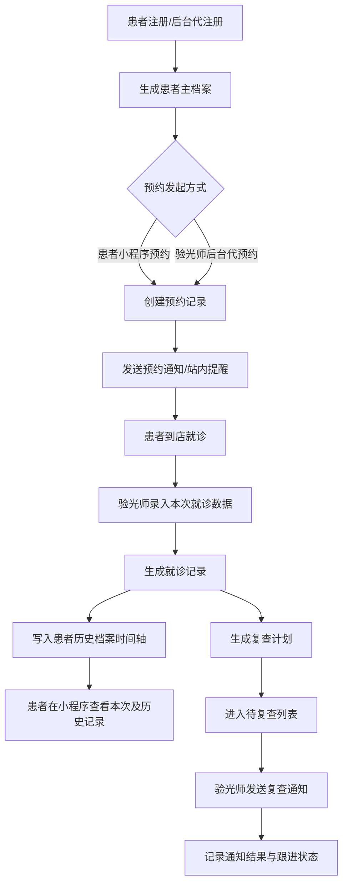
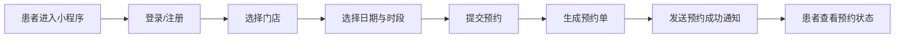
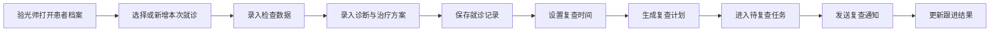
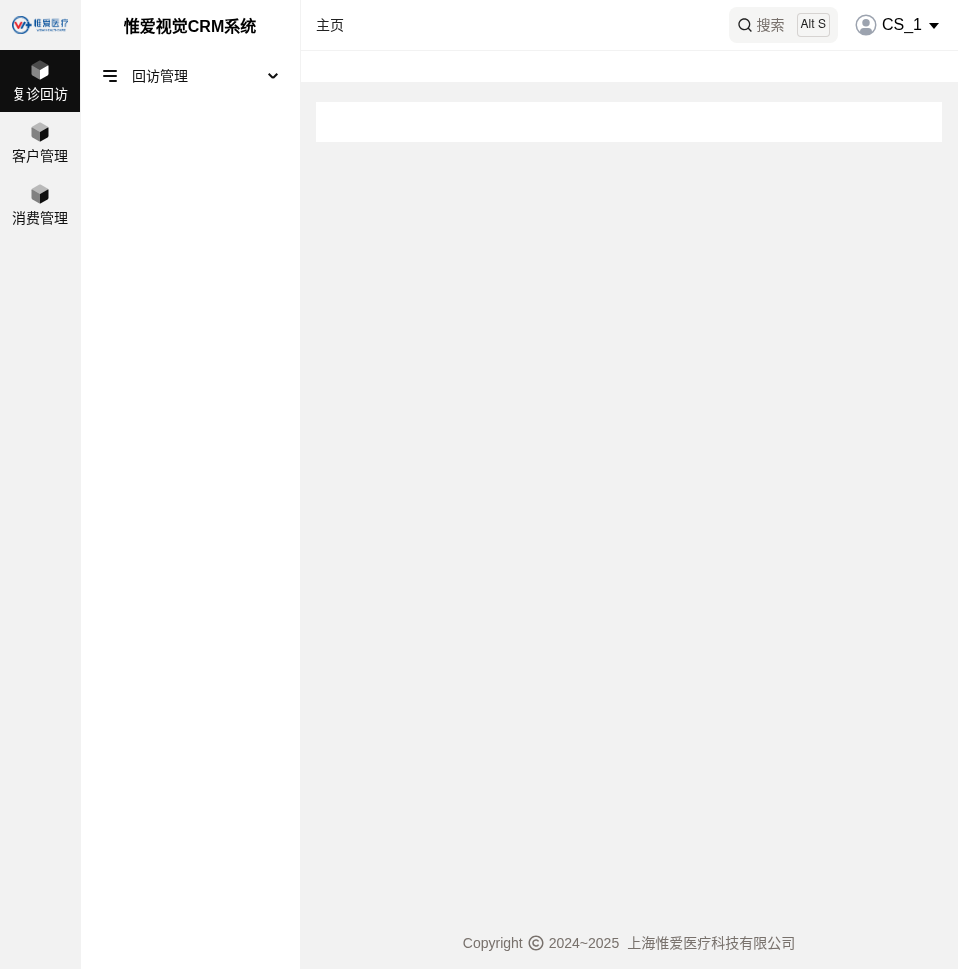
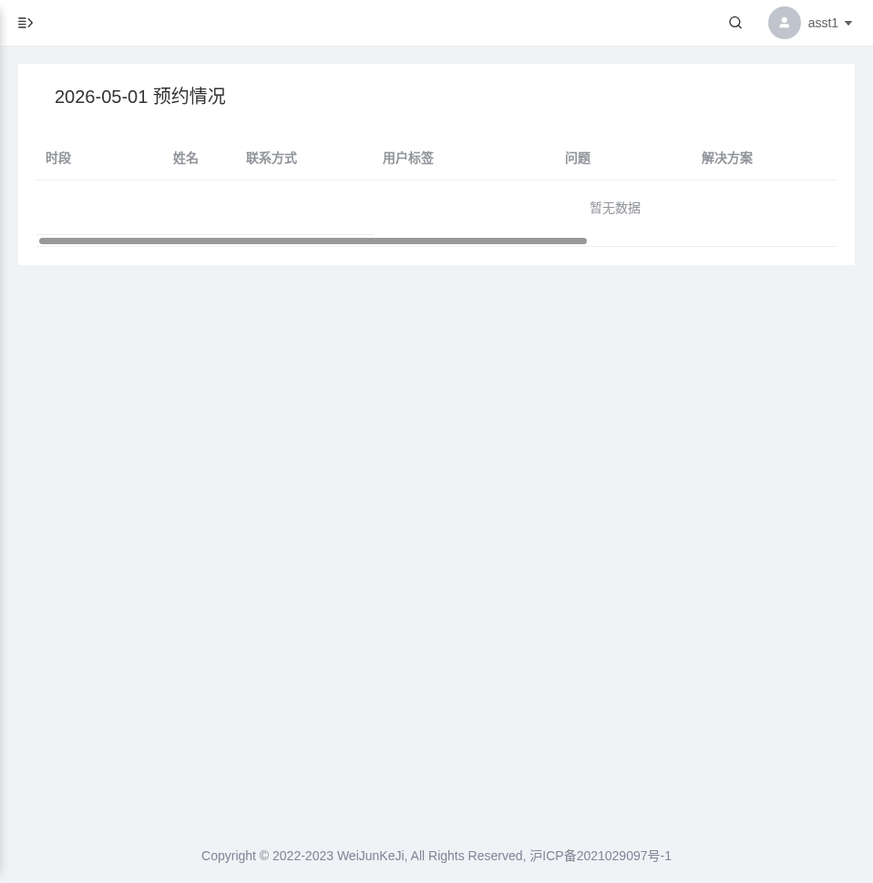

# 新 CRM 客户管理系统 PRD

## 1. 文档信息

| 项目 | 内容 |
|---|---|
| 文档名称 | 新 CRM 客户管理系统 PRD |
| 版本 | V1.0 |
| 输出格式 | Markdown |
| 适用范围 | Admin 后台管理系统、小程序 |
| 编写目的 | 用于统一业务目标、明确一期范围、指导 Admin 与小程序设计及研发实施 |

## 2. 项目背景

当前业务存在两个独立系统：

1. `Weiai CRM 客户管理系统`
2. `Weiai 后台管理系统`

在实际使用中，最大的痛点不是某个功能单点缺失，而是**患者信息、就诊档案、预约、方案、复查提醒分散在两个系统中，数据不互通**，从而带来以下问题：

1. 同一患者需要重复建档、重复录入信息。
2. 验光师无法在一个页面完整查看患者全生命周期数据。
3. 患者缺少统一入口查看自己的预约与历次就诊数据。
4. 复查提醒依赖人工记忆或分散记录，执行不稳定。
5. 后续做 Admin 和小程序时，旧系统功能与新系统页面关系不清晰，容易重复设计。

因此，本项目目标不是简单“迁移旧系统页面”，而是整合形成一个新的 CRM 客户管理系统，包含：

1. `Admin 后台管理系统`
2. `患者小程序`

## 3. 产品目标

### 3.1 业务目标

1. 建立统一患者主档案，避免重复录入。
2. 打通患者从注册、预约、到诊、检查、治疗、复查的完整链路。
3. 提升验光师对患者历史记录、当前状态和复查计划的管理效率。
4. 让患者能够在小程序内自助完成预约、查看历史数据、接收通知。

### 3.2 产品目标

1. Admin 端以“患者档案”为核心。
2. 小程序端以“预约 + 历史数据查看 + 通知接收”为核心。
3. 一期聚焦最关键的业务闭环，避免被仓储、商城、复杂分析等扩展功能拖慢。

### 3.3 成功标准

1. 患者只需建立一个主档案。
2. 患者注册后即可在小程序使用预约和查看历史数据功能。
3. 验光师可在后台完整录入并查看患者历次就诊记录。
4. 复查通知有明确计划、执行记录和状态留痕。

## 4. 一期建设范围

## 4.1 一期必做范围

1. 患者小程序注册 / 登录
2. 后台代患者注册
3. 患者小程序预约
4. 后台代预约
5. 验光师录入就诊数据
6. 患者查看全部历史就诊数据
7. 验光师查看全部患者数据
8. 复查计划与复查通知
9. 历史数据迁移

## 4.2 一期建议保留但可做轻量版本

1. 面单 / 清单
2. 门店管理
3. 简单数据分析
4. 权限管理
5. 通知模板配置

## 4.3 二期可扩展范围

1. 商城购买
2. 在线沟通
3. 数据趋势图对比
4. 仓储深化
5. 套餐卡深度管理
6. 诊间现场串联调度

## 5. 用户角色与权限

| 角色 | 主要职责 | 核心权限 |
|---|---|---|
| 患者 | 自助预约、查看数据、接收通知 | 注册登录、预约、查看历史数据、查看通知 |
| 验光师 | 建档、预约、就诊录入、复查跟进 | 代注册、代预约、录入就诊、查看患者、发起复查通知 |
| 门店管理员 | 门店运营管理 | 查看门店数据、配置基础信息、查看统计 |
| 超级管理员 | 系统管理与初始化 | 角色权限、门店配置、系统配置、数据迁移 |

## 6. 核心业务闭环

新 CRM 的核心闭环应为：

1. 患者注册
2. 预约
3. 到诊
4. 就诊数据录入
5. 历史数据沉淀
6. 复查计划
7. 复查通知

## 7. 完整业务流程图

### 7.1 一期完整业务流程

### 7.2 患者端预约流程

### 7.3 验光师就诊录入与复查流程

## 8. 产品结构

## 8.1 Admin 后台信息架构

### 一级菜单建议

1. 患者档案管理
2. 预约管理
3. 就诊记录管理
4. 复查管理
5. 面单/清单
6. 数据统计
7. 基础配置

### 二级菜单建议

| 一级菜单 | 二级菜单 | 说明 |
|---|---|---|
| 患者档案管理 | 新增患者档案 | 后台代注册并建档 |
| 患者档案管理 | 患者档案列表 | 核心数据库视图 |
| 预约管理 | 预约列表 | 所有预约统一管理 |
| 预约管理 | 新增预约 | 后台代患者预约 |
| 就诊记录管理 | 新增就诊记录 | 录入本次检查/诊断/方案 |
| 就诊记录管理 | 就诊记录查询 | 面向后台查询与追溯 |
| 复查管理 | 待复查列表 | 核心工作台 |
| 复查管理 | 通知记录 | 查看通知历史 |
| 面单/清单 | 费用清单 | 生成面单、清单 |
| 数据统计 | 运营统计 | 简版统计即可 |
| 基础配置 | 门店管理 | 一期建议轻量化 |
| 基础配置 | 角色权限 | 数据权限与角色控制 |

## 8.2 小程序信息架构

### 一级页面建议

1. 首页
2. 预约
3. 我的档案
4. 我的就诊记录
5. 我的通知

### 页面说明

| 页面 | 核心功能 |
|---|---|
| 首页 | 当前预约、最近就诊、下次复查提醒、快捷入口 |
| 预约 | 选择门店、日期、时段并发起预约 |
| 我的档案 | 基本资料、绑定信息 |
| 我的就诊记录 | 查看历次记录与详情 |
| 我的通知 | 预约通知、复查提醒、系统通知 |

## 9. 核心页面需求

## 9.1 患者档案列表页

### 页面目标

为后台人员提供统一的患者查询与管理入口。

### 页面要素

1. 顶部检索栏
2. 中部列表
3. 右侧操作列

### 检索条件建议

1. 患者姓名
2. 手机号
3. 最近就诊时间范围
4. 复查状态
5. 门店
6. 验光师

### 列表字段建议

1. 最近就诊时间
2. 患者姓名
3. 联系方式
4. 诊断
5. 主要治疗手段
6. 复查日期
7. 跟进状态
8. 操作

### 操作项建议

1. 新增就诊数据
2. 查看详情
3. 编辑
4. 删除
5. 发起复查通知

## 9.2 患者详情页

### 页面目标

作为新 CRM 的绝对核心页面，承接患者所有历史记录和后续操作。

### 页面结构建议

1. 顶部：患者基本信息卡
2. 左侧：历次就诊时间轴
3. 右侧：当前选中记录详情

### 详情分区建议

1. 基本信息
2. 检查数据
3. 诊断结果
4. 治疗方案
5. 面单/清单
6. 复查建议
7. 通知记录

## 9.3 新增就诊记录页

### 页面目标

让验光师快速、标准化地录入本次就诊信息。

### 核心字段

1. 就诊日期
2. 接诊门店
3. 接诊验光师
4. 主诉
5. 检查数据
6. 诊断结论
7. 治疗手段
8. 产品/套餐建议
9. 复查时间
10. 备注

## 9.4 预约管理页

### 页面目标

统一管理患者自助预约与后台代预约。

### 列表字段建议

1. 预约日期
2. 预约时段
3. 患者姓名
4. 联系方式
5. 门店
6. 预约来源
7. 预约状态
8. 操作

## 9.5 复查管理页

### 页面目标

成为验光师日常复查跟进工作台。

### 列表字段建议

1. 患者姓名
2. 联系方式
3. 最近就诊时间
4. 复查日期
5. 主问题
6. 主要治疗手段
7. 通知状态
8. 最近通知时间
9. 跟进结果

## 10. 功能需求明细

## 10.1 患者注册与账号体系

### 需求说明

1. 新患者支持在小程序注册。
2. 验光师支持在后台代注册。
3. 旧系统患者数据需迁移到新系统。
4. 患者注册后自动生成患者主档案。

### 验收标准

1. 小程序新注册成功后能进入系统。
2. 后台代注册成功后，患者档案自动创建。
3. 重复手机号不可重复生成新主档案。

## 10.2 预约管理

### 需求说明

1. 患者可在小程序预约。
2. 验光师可在后台为患者代预约。
3. 后台代预约后，患者小程序需收到预约通知。
4. 支持预约状态管理。

### 预约状态建议

1. 待到诊
2. 已到诊
3. 已取消
4. 已爽约
5. 已完成

## 10.3 就诊数据录入

### 需求说明

1. 验光师可新增就诊记录。
2. 每次就诊记录归属于某位患者。
3. 就诊记录保存后，自动进入患者历史时间轴。
4. 同一患者可存在多次记录。

## 10.4 患者查看历史数据

### 需求说明

1. 患者可在小程序查看全部历史就诊记录。
2. 患者可查看每次记录的检查与方案摘要。
3. 一期先支持结构化查看，不强求复杂图表。

## 10.5 复查通知

### 需求说明

1. 验光师可为患者设置复查时间。
2. 系统自动生成复查计划。
3. 后台展示待复查列表。
4. 验光师可发送复查提醒并记录结果。

## 10.6 面单/清单

### 需求说明

1. 继承旧系统的清单能力。
2. 支持选择检查项目、处方项目、治疗项目。
3. 支持计算金额、提交清单、生成清单。
4. 最终与就诊记录关联。

## 11. 核心字段表

## 11.1 患者主档案

| 字段名 | 类型 | 必填 | 说明 |
|---|---|---|---|
| patient_id | String | 是 | 患者唯一 ID |
| name | String | 是 | 患者姓名 |
| gender | Enum | 否 | 性别 |
| birthday | Date | 否 | 出生日期 |
| mobile | String | 是 | 手机号，重要去重依据 |
| wechat_open_id | String | 否 | 小程序绑定标识 |
| first_visit_date | Date | 否 | 首诊日期 |
| latest_visit_date | Date | 否 | 最近就诊日期 |
| primary_store_id | String | 否 | 首选/归属门店 |
| current_follow_status | Enum | 否 | 当前跟进状态 |
| source_type | Enum | 否 | 注册来源：小程序/后台导入/迁移 |
| remark | String | 否 | 备注 |

## 11.2 预约记录

| 字段名 | 类型 | 必填 | 说明 |
|---|---|---|---|
| appointment_id | String | 是 | 预约唯一 ID |
| patient_id | String | 是 | 关联患者 |
| appointment_date | Date | 是 | 预约日期 |
| appointment_period | String | 是 | 预约时段 |
| store_id | String | 是 | 预约门店 |
| source_type | Enum | 是 | 小程序预约 / 后台代预约 |
| status | Enum | 是 | 待到诊、已到诊、已取消、已爽约、已完成 |
| created_by | String | 是 | 创建人 |
| created_role | Enum | 是 | 患者 / 验光师 / 管理员 |
| note | String | 否 | 预约备注 |

## 11.3 就诊记录

| 字段名 | 类型 | 必填 | 说明 |
|---|---|---|---|
| visit_id | String | 是 | 就诊记录唯一 ID |
| patient_id | String | 是 | 关联患者 |
| appointment_id | String | 否 | 关联预约 |
| visit_date | DateTime | 是 | 就诊时间 |
| store_id | String | 是 | 接诊门店 |
| optometrist_id | String | 是 | 接诊验光师 |
| chief_complaint | String | 否 | 主诉/问题 |
| diagnosis | String | 否 | 诊断结论 |
| treatment_method | String | 否 | 主要治疗手段 |
| treatment_plan | String | 否 | 详细方案 |
| review_date | Date | 否 | 建议复查时间 |
| remark | String | 否 | 备注 |

## 11.4 检查数据

说明：检查数据建议采用“基础字段 + 扩展指标 JSON”的组合方式，以适配不同检查类型。

| 字段名 | 类型 | 必填 | 说明 |
|---|---|---|---|
| exam_id | String | 是 | 检查记录 ID |
| visit_id | String | 是 | 所属就诊记录 |
| exam_type | Enum | 是 | 验光/眼轴/视力/问卷/其他 |
| od_sphere | Number | 否 | 右眼球镜 |
| od_cylinder | Number | 否 | 右眼柱镜 |
| od_axis | Number | 否 | 右眼轴位 |
| os_sphere | Number | 否 | 左眼球镜 |
| os_cylinder | Number | 否 | 左眼柱镜 |
| os_axis | Number | 否 | 左眼轴位 |
| vision_data | JSON | 否 | 视力相关数据 |
| axial_length_data | JSON | 否 | 眼轴相关数据 |
| questionnaire_data | JSON | 否 | 问卷结果 |
| raw_metrics | JSON | 否 | 原始检查指标扩展字段 |

## 11.5 复查计划

| 字段名 | 类型 | 必填 | 说明 |
|---|---|---|---|
| review_task_id | String | 是 | 复查任务 ID |
| patient_id | String | 是 | 患者 ID |
| visit_id | String | 是 | 来源就诊记录 |
| review_date | Date | 是 | 计划复查日期 |
| review_reason | String | 否 | 复查原因 |
| notify_status | Enum | 是 | 未通知/已通知/已完成 |
| latest_notify_time | DateTime | 否 | 最近通知时间 |
| notify_count | Number | 否 | 通知次数 |
| follow_result | String | 否 | 跟进结果 |
| owner_id | String | 否 | 责任验光师 |

## 11.6 通知记录

| 字段名 | 类型 | 必填 | 说明 |
|---|---|---|---|
| notification_id | String | 是 | 通知记录 ID |
| patient_id | String | 是 | 患者 ID |
| business_type | Enum | 是 | 预约通知 / 复查通知 / 系统通知 |
| template_code | String | 否 | 消息模板编码 |
| channel | Enum | 是 | 小程序订阅消息 / 站内消息 / 人工通知 |
| content | String | 是 | 通知内容 |
| status | Enum | 是 | 待发送 / 已发送 / 失败 |
| send_time | DateTime | 否 | 发送时间 |
| operator_id | String | 否 | 操作人 |

## 12. 数据迁移需求

## 12.1 迁移目标

1. 后台管理系统中的用户档案迁移为新系统患者主档案。
2. 历史就诊、方案、复查信息迁移为新系统时间轴数据。
3. 旧 CRM 中涉及回访、客户、消费等有价值数据需评估迁移映射。
4. 旧用户应能在新小程序内完成账号激活或直接绑定。

## 12.2 迁移原则

1. 以系统唯一 ID 为主、手机号为重要合并辅助依据。
2. 发现重复患者时，保留人工校验能力。
3. 保留原系统来源字段，方便回溯。
4. 迁移前后需提供数据核对机制。

## 13. 权限与数据隔离

一期必须先定义以下规则：

1. 不同门店是否彼此隔离数据。
2. 验光师是否只能看自己负责的患者。
3. 管理员是否可看全量患者。
4. 删除是否逻辑删除。
5. 患者是否能看到全部记录，还是仅能看到“已发布给患者”的记录。

建议默认策略：

1. 患者只能看自己的数据。
2. 验光师默认看本门店数据。
3. 管理员可看授权范围内全部数据。
4. 删除采用逻辑删除。

## 14. 报表需求

一期仅做轻量统计：

1. 新增患者数
2. 预约数
3. 到诊数
4. 已完成就诊数
5. 待复查人数
6. 已通知人数
7. 未通知人数
8. 门店维度统计
9. 验光师维度统计

## 15. 非功能需求

1. 后台列表检索速度可接受。
2. 小程序页面需适配常见机型。
3. 历史就诊记录需支持结构化展示。
4. 关键操作需留痕：建档、预约、录入、通知。
5. 数据具备可扩展性，便于二期做图表分析。

## 16. 原系统功能映射与截图参考

本章节用于帮助后续设计时明确：**新系统的某个页面，是从旧系统哪个页面延续、改造或抽象出来的。**

## 16.1 旧系统概览

### 旧 CRM 系统真实截图

说明：

1. 旧 CRM 当前以 `复诊回访`、`客户管理`、`消费管理` 为主。
2. 当前页面偏轻量，更多像业务入口壳。
3. 可抽取其“回访/客户”的业务含义，但不建议沿用原页面结构。

### 旧后台系统真实首页截图

说明：

1. 首页核心是当日预约情况。
2. 说明“预约管理”在旧系统中是明确存在的独立主模块。

## 16.2 新旧功能映射表

| 新系统模块 | 新页面/能力 | 对应旧系统来源 | 处理方式 | 说明 |
|---|---|---|---|---|
| 患者账号 | 小程序注册/登录 | 文档中的旧小程序注册登录页 | 保留并重做 | 做统一账号体系，承接迁移用户 |
| 患者档案管理 | 患者档案列表 | 旧后台“用户档案” + 文档中的档案列表建议 | 核心重构 | 改造成统一数据库视图 |
| 患者详情页 | 时间轴 + 检查详情 | 文档中的详情页示意 | 核心新建 | 新系统最关键页面 |
| 预约管理 | 预约列表/新增预约 | 旧后台“预约管理” | 保留并重构 | 同时支持患者自助与后台代预约 |
| 就诊记录 | 新增就诊记录 | 旧后台分散在问卷、配镜、档案、方案中的数据录入 | 融合重构 | 统一为一次就诊记录 |
| 面单/清单 | 费用清单页 | 旧后台“清单打印” | 保留改造 | 与就诊记录关联 |
| 复查管理 | 待复查列表/通知记录 | 旧 CRM“复诊回访” + 旧后台档案/方案信息 | 核心增强 | 从隐性能力变成显性模块 |
| 患者历史查看 | 小程序查看全部记录 | 旧系统无统一患者视角 | 新建 | 形成患者可见端闭环 |

## 16.3 账号与注册参考截图

### 文档中的旧小程序注册/登录参考

映射说明：

1. 对应新小程序 `登录/注册` 页面。
2. 旧用户迁移后，需通过统一账号体系进入新系统。

## 16.4 档案列表与详情参考截图

### 文档中的患者档案列表参考

### 文档中的患者详情/时间轴参考

映射说明：

1. 这两张图直接对应新系统 `患者档案列表页` 和 `患者详情页` 的设计方向。
2. 尤其“左侧时间轴 + 右侧详情”的思路，应作为新系统重点保留。

## 16.5 预约模块参考截图

### 文档中的患者端预约参考

### 文档中的后台代预约参考

### 旧后台真实预约首页截图

映射说明：

1. 新系统需保留“患者端预约 + 后台代预约”双入口。
2. 预约状态、预约来源、通知能力应在新系统中显式化。

## 16.6 旧后台真实数据列表参考

### 旧后台真实问卷列表截图

映射说明：

1. 旧后台中部分业务数据以列表形式沉淀。
2. 新系统不建议继续按“问卷、配镜、档案”零散拆分，而应统一归并到 `患者详情 -> 历次就诊记录`。

## 16.7 面单/清单参考截图

### 文档中的面单参考

### 旧后台真实清单打印截图

映射说明：

1. 新系统可保留旧后台“清单打印”的项目组合能力。
2. 但需把它从独立复杂功能，收敛为“就诊记录的附属能力”。

## 17. 需求优先级

### P0

1. 患者主档案
2. 注册登录
3. 后台代注册
4. 小程序预约
5. 后台代预约
6. 就诊记录录入
7. 患者详情页
8. 患者历史记录查看
9. 复查计划与复查通知
10. 数据迁移

### P1

1. 面单/清单
2. 基础统计
3. 门店管理
4. 角色权限
5. 通知模板

### P2

1. 商城
2. 在线沟通
3. 趋势图分析
4. 仓储深化
5. 套餐卡深度能力

## 18. 风险与待确认问题

以下问题建议在产品评审前明确：

1. 面单功能是否为一期必须上线。
2. 小程序订阅消息是否具备可申请条件。
3. 患者可见数据是否需要“医生/验光师发布后才可见”。
4. 不同门店之间是否需要数据隔离。
5. 历史数据迁移的主键合并规则是否以手机号为主。
6. 就诊数据录入角色是否只有验光师，还是医生/护士/前台也参与。

## 19. 结论

新 CRM 不应继续沿用旧后台“功能散、页面并列很多”的架构，而应该改造为：

1. 以 `患者档案` 为中心
2. 以 `就诊记录时间轴` 为核心承载
3. 以 `预约` 作为前置入口
4. 以 `复查管理` 作为后置跟进核心
5. 以 `小程序` 承接患者侧自助能力

这套 PRD 同时补充了：

1. 一期正式需求范围
2. 完整业务流程图
3. 核心字段表
4. 原系统截图与新旧功能映射

可直接作为后续：

1. Admin 页面结构设计基础
2. 小程序页面结构设计基础
3. 原型设计基础
4. 技术方案拆解基础
