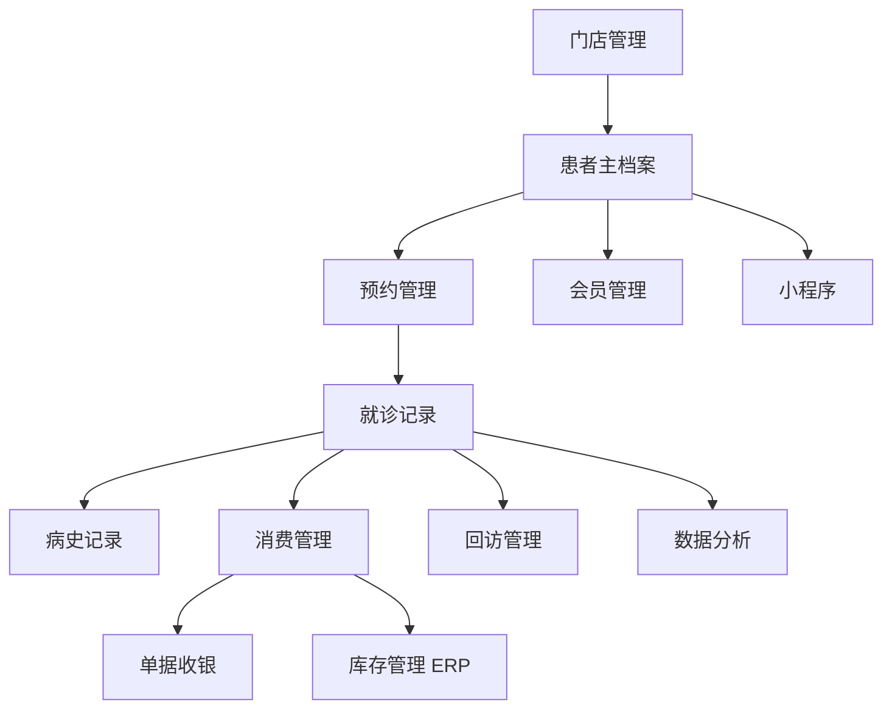

# 新 CRM 客户管理系统 PRD
## Admin 骨架适配版

## 1. 文档定位

本文件是在 `新CRM正式PRD.md` 基础上的**Admin 骨架适配版补充文档**，目的不是推翻原 PRD，而是将原有需求明确映射到你已经实现的 Admin 系统框架中，形成一份可直接用于：

1. 后续 Admin 原型设计
2. 页面拆分与研发排期
3. 旧系统字段迁移与兼容
4. 小程序与 Admin 协同设计

本版重点补充：

1. 现有 Admin 菜单骨架适配方案
2. `客户档案(CRM)` 子模块完整需求补全
3. 原系统表单、表格字段保留原则
4. 页面交互与体验优化原则
5. 与 `门店管理 / 数据分析 / 库存管理(ERP) / 单据收银` 的联动边界

## 2. 当前 Admin 骨架参考

### 2.1 当前骨架截图

### 2.2 当前一级菜单结构

根据当前骨架，Admin 已有以下主菜单：

1. `仪表盘`
2. `门店管理`
3. `数据分析`
4. `客户档案(CRM)`
5. `库存管理(ERP)`
6. `单据收银`

其中，`客户档案(CRM)` 当前已规划的二级菜单包括：

1. `客户列表`
2. `消费管理`
3. `预约管理`
4. `回访管理`
5. `病史记录`
6. `会员管理`

## 3. 核心适配原则

本项目不是“重做一个后台”，而是**在现有 Admin 框架下完成眼科 CRM 专业化升级**。

因此遵循以下四个原则：

### 3.1 菜单框架尽量不改

1. 保留现有一级菜单结构。
2. `客户档案(CRM)` 作为本次重点改造模块。
3. 与 CRM 强相关但已有归属的能力，不强行迁入 CRM 顶层菜单。

### 3.2 原系统关键字段尽量不变

1. 原系统已在用的表单字段、表格字段、业务字段保持兼容。
2. 老用户习惯的关键业务术语尽量延续。
3. 新系统主要升级的是交互方式、数据组织方式和联动效率。

### 3.3 数据结构统一，但页面入口可分模块

1. 患者主档案是唯一中心。
2. 预约、就诊、消费、回访、病史、会员都围绕患者主档案聚合。
3. 页面入口可以分散，但底层数据必须统一。

### 3.4 交互升级优先于功能堆叠

本次改造重点是：

1. 让录入更快
2. 让查看更清晰
3. 让跨模块跳转更顺
4. 让复查跟进更高效

不是增加大量新而复杂的页面。

## 4. 新 CRM 在现有骨架中的定位

## 4.1 模块关系

新 CRM 不等于整个 Admin，而是该 Admin 里的核心业务域，主要落在：

1. `客户档案(CRM)` 为主战场
2. `门店管理` 提供组织、人员、排班基础数据
3. `数据分析` 消费 CRM 数据做统计与趋势展示
4. `库存管理(ERP)` 提供药品、耗材、商品、套餐等能力
5. `单据收银` 承接费用清单、收费、对账

## 4.2 模块职责划分

| 一级模块 | 在新系统中的职责 | 是否本次重点改造 |
|---|---|---|
| 仪表盘 | 展示经营、预约、复查、到诊等核心看板 | 中 |
| 门店管理 | 管理人员、诊室、排班，为预约和接诊提供基础配置 | 中 |
| 数据分析 | 基于 CRM 数据做经营和患者数据分析 | 中 |
| 客户档案(CRM) | 患者管理、预约、病史、回访、消费、会员的核心模块 | 高 |
| 库存管理(ERP) | 药品/商品/耗材/套餐等库存能力 | 低到中 |
| 单据收银 | 清单、收费、开单、支付、对账 | 中 |

## 5. 一级菜单适配方案

## 5.1 仪表盘

### 保留定位

继续作为院区/门店管理首页，不改菜单位置。

### 建议升级内容

保留经营看板风格，但数据源切换为新 CRM 聚合数据，新增与眼科场景更相关的内容：

1. 今日预约总量
2. 今日到诊人数
3. 今日新增患者数
4. 今日新增就诊记录数
5. 今日待回访人数
6. 本周复查到期人数
7. 门店满意度
8. 医生/验光师工作负载

### 交互优化

1. 卡片支持点击跳转到对应列表。
2. 支持门店维度筛选。
3. 支持时间切换：今日 / 本周 / 本月。

## 5.2 门店管理

### 保留定位

继续放在 CRM 之外，作为组织与资源管理模块。

### 与 CRM 的联动关系

1. `人员管理` 提供验光师、医生、前台等角色基础信息。
2. `诊室管理` 影响预约资源和接诊流程。
3. `门店排班` 决定可预约时段与值班人员。

### 本次补充要求

门店管理不重构为 CRM 页面，但必须为 CRM 提供：

1. 标准人员主数据
2. 标准诊室主数据
3. 标准班次数据
4. 门店与人员的归属关系

## 5.3 数据分析

### 保留定位

继续作为独立一级菜单保留。

### 数据来源要求

原来的分析不能再依赖多个系统散落数据，而应统一来自新 CRM 主数据。

### 一期建议保留的分析面板

1. 新增患者趋势
2. 预约量趋势
3. 到诊率
4. 复查执行率
5. 消费转化率
6. 门店维度经营分析
7. 医生/验光师维度效率分析

## 5.4 客户档案(CRM)

### 保留定位

这是本次重点改造模块，保留当前一级菜单名称和位置。

### 设计原则

1. 不改变“客户档案(CRM)”在整体骨架中的位置。
2. 尽量沿用你现在已规划的二级菜单。
3. 用统一数据模型把这些菜单真正串起来。

## 5.5 库存管理(ERP)

### 保留定位

库存与药品、商品、套餐属于业务支撑模块，不建议迁入 CRM。

### 与 CRM 的联动要求

1. 就诊开方案时可关联商品/药品/耗材。
2. 面单生成时可读取 ERP 商品与价格。
3. 套餐或会员权益涉及库存/商品时由 ERP 提供能力。

## 5.6 单据收银

### 保留定位

收银与单据保持独立一级菜单。

### 与 CRM 的联动要求

1. 由患者就诊记录或清单页发起开单。
2. 收费结果回写患者消费记录。
3. 患者详情页可查看消费和收费摘要。

## 6. 客户档案(CRM) 子模块适配

## 6.1 总体定位

`客户档案(CRM)` 应被定义为新系统核心业务工作台。

它不是单纯的“客户列表”，而是覆盖：

1. 患者主档案
2. 预约
3. 就诊记录
4. 消费/方案
5. 回访/复查
6. 病史沉淀
7. 会员关系

## 6.2 二级菜单保留与重构建议

| 现有二级菜单 | 是否保留 | 新定位 | 说明 |
|---|---|---|---|
| 客户列表 | 保留 | 患者主档案入口 | CRM 核心入口 |
| 消费管理 | 保留 | 消费记录/方案成交管理 | 与收银联动，保留销售视角 |
| 预约管理 | 保留 | 预约全流程管理 | 患者预约 + 后台代预约 |
| 回访管理 | 保留 | 复查回访工作台 | 由弱回访升级为强任务中心 |
| 病史记录 | 保留 | 患者历次就诊时间轴与病史查询 | 承接专业病史浏览 |
| 会员管理 | 保留 | 会员权益/套餐/卡项管理 | 轻量保留，避免过度复杂 |

## 7. CRM 模块完整页面需求

## 7.1 客户列表

### 页面定位

客户列表是整个 CRM 的总入口，承担：

1. 患者查询
2. 患者建档
3. 快速进入详情
4. 从患者维度发起预约、就诊、回访、消费操作

### 需要保留的原始字段

参考原需求和旧系统，以下字段应尽量保留：

1. 最近就诊时间
2. 就诊人/患者姓名
3. 联系方式
4. 诊断
5. 主要治疗手段
6. 操作

### 建议新增字段

1. 患者编号
2. 性别
3. 年龄
4. 所属门店
5. 最近预约状态
6. 下次复查日期
7. 当前跟进状态
8. 患者标签
9. 会员状态

### 列表操作

1. 查看详情
2. 新增就诊
3. 新建预约
4. 发起回访
5. 编辑档案
6. 删除/停用

### 交互优化要求

1. 顶部支持全局搜索：手机号、姓名、患者编号。
2. 支持自定义显示列和列顺序。
3. 支持保存筛选方案。
4. 点击行优先打开详情抽屉或详情页，而不是频繁跳全新页面。
5. 操作列支持常用动作直达。
6. 支持“最近操作患者”快捷访问。

## 7.2 客户详情

### 页面定位

客户详情页是新系统的核心页面，建议作为 CRM 中枢。

### 页面结构

1. 顶部：患者基础信息头部卡片
2. 左侧：病史/就诊时间轴
3. 右侧：本次选中记录详情
4. 页签：档案 / 预约 / 病史 / 消费 / 回访 / 会员

### 顶部信息建议

1. 姓名
2. 性别
3. 年龄
4. 联系方式
5. 患者编号
6. 患者标签
7. 所属门店
8. 最近就诊时间
9. 下次复查时间
10. 会员状态

### 交互优化要求

1. 固定患者身份头部，不因滚动消失。
2. 时间轴切换后，右侧详情即时刷新。
3. 支持多标签页查看，不丢当前筛选状态。
4. 关键动作按钮固定在头部：新增预约、录入就诊、发起回访、开单。

## 7.3 预约管理

### 页面定位

统一管理患者自助预约和后台代预约。

### 需要保留的原始字段

参考旧后台预约页，需保留：

1. 时段
2. 姓名
3. 联系方式
4. 用户标签
5. 问题
6. 解决方案
7. 备注
8. 预约状态

### 建议新增字段

1. 预约编号
2. 预约来源
3. 预约门店
4. 预约诊室
5. 预约验光师
6. 通知状态
7. 到诊状态
8. 创建时间
9. 创建人

### 页面形态建议

同一页面支持两种视图：

1. 列表视图
2. 日历/排班视图

### 交互优化要求

1. 日历视图可直接查看某日某门店预约饱和度。
2. 新增预约支持侧边抽屉，不强制全页跳转。
3. 后台代预约时自动带出患者基本信息。
4. 支持“改期、取消、标记到诊、标记爽约”快捷操作。
5. 若排班与诊室可用，预约时自动校验冲突。

## 7.4 回访管理

### 页面定位

从旧 CRM 的“回访管理”升级为**复查回访任务中心**。

### 建议保留的业务核心

1. 患者回访
2. 复查提醒
3. 跟进记录

### 建议列表字段

1. 患者姓名
2. 联系方式
3. 最近就诊时间
4. 诊断
5. 主要治疗手段
6. 应复查日期
7. 回访状态
8. 最近通知时间
9. 最近跟进结果
10. 责任人

### 操作项

1. 发起回访
2. 记录跟进结果
3. 改期复查
4. 查看病史
5. 查看消费记录

### 交互优化要求

1. 自动按复查到期时间排序。
2. 提供今日待回访、逾期未回访、已完成回访快捷筛选。
3. 支持批量通知和单个通知。
4. 提供标准回访话术模板。
5. 通知后自动沉淀到回访日志。

## 7.5 病史记录

### 页面定位

病史记录不只是“历史文字记录”，而是眼科专业数据的结构化时间轴。

### 建议保留的专业检查维度

来自旧系统数据分析与检查记录的核心字段建议全部保留：

1. 裸眼视力
2. 最佳矫正视力
3. 球镜
4. 柱镜
5. 轴位
6. SE
7. 角膜曲率
8. K1
9. K2
10. 眼轴
11. 轴率比
12. CRT
13. RNFL
14. 眼压
15. 角膜厚度
16. 角膜内皮计数
17. 立体视
18. 泪膜破裂时间
19. 泪液分泌试验

### 页面形态建议

1. 左侧时间轴
2. 右侧当前就诊详情
3. 上方可切换：双眼 / 右眼 / 左眼
4. 支持同指标多次对比

### 交互优化要求

1. 支持从患者详情直接进入病史页签。
2. 支持按指标筛选查看。
3. 支持打印或导出单次记录摘要。
4. 支持“本次 vs 上次”对比查看。

## 7.6 消费管理

### 页面定位

保留消费管理，不再只是销售台账，而是患者方案成交与支付记录汇总入口。

### 建议保留的业务信息

1. 方案情况
2. 成交折扣比例
3. 主要消费项目
4. 消费金额
5. 成交时间

### 建议新增字段

1. 关联患者
2. 关联就诊记录
3. 关联清单编号
4. 支付状态
5. 支付方式
6. 收银单号
7. 退款状态

### 交互优化要求

1. 从客户详情页可直接跳到该患者消费记录。
2. 从消费记录可回跳对应就诊记录和清单。
3. 支持按门店、时间、验光师、消费项目筛选。

## 7.7 会员管理

### 页面定位

会员管理保留，但一期建议轻量化。

### 建议保留内容

1. 会员等级
2. 套餐/卡项
3. 有效期
4. 剩余次数/余额
5. 激活状态

### 交互优化要求

1. 在患者详情页展示会员摘要。
2. 支持直接跳转至会员详情。
3. 会员变更操作需要留痕。

## 8. 原系统字段保留清单

本章节用于明确“哪些旧字段必须保留”，便于后续设计和建模。

## 8.1 档案/客户列表保留字段

| 字段 | 是否保留 | 说明 |
|---|---|---|
| 最近就诊时间 | 是 | 用于快速判断患者活跃度 |
| 就诊人/姓名 | 是 | 主标识字段 |
| 联系方式 | 是 | 核心检索字段 |
| 诊断 | 是 | 保留业务判断依据 |
| 主要治疗手段 | 是 | 保留方案摘要 |
| 操作 | 是 | 保留快捷业务入口 |

## 8.2 预约管理保留字段

| 字段 | 是否保留 | 说明 |
|---|---|---|
| 时段 | 是 | 保留 |
| 姓名 | 是 | 保留 |
| 联系方式 | 是 | 保留 |
| 用户标签 | 是 | 保留 |
| 问题 | 是 | 保留 |
| 解决方案 | 是 | 保留 |
| 备注 | 是 | 保留 |
| 预约状态 | 是 | 保留 |

## 8.3 问卷/检查结果保留字段

| 字段 | 是否保留 | 说明 |
|---|---|---|
| 姓名 | 是 | 保留 |
| 问卷日期 | 是 | 保留 |
| 问卷类型 | 是 | 保留 |
| 得分 | 是 | 保留 |
| 评价 | 是 | 保留 |
| 查看详情 | 是 | 保留入口 |

## 8.4 清单打印保留字段

| 字段/分组 | 是否保留 | 说明 |
|---|---|---|
| 挂号费 | 是 | 保留 |
| 检查 | 是 | 保留 |
| 处方 | 是 | 保留 |
| 治疗 | 是 | 保留 |
| 视力矫正治疗费 | 是 | 保留 |
| 套餐费用 | 是 | 保留 |
| 快捷选项 | 是 | 保留 |
| 增加项目 | 是 | 保留 |
| 计算 | 是 | 保留 |
| 提交清单 | 是 | 保留 |
| 生成清单 | 是 | 保留 |

## 9. 表单与表格交互升级要求

## 9.1 表格交互统一规范

所有 CRM 列表页建议统一具备：

1. 顶部检索栏
2. 高级筛选
3. 自定义列
4. 固定表头
5. 固定操作列
6. 列宽拖拽
7. 行点击查看详情
8. 批量操作
9. 导出
10. 保存筛选视图

## 9.2 表单交互统一规范

所有新增/编辑表单建议统一具备：

1. 分步或分组表单
2. 自动保存草稿
3. 必填项显著提示
4. 历史信息自动带出
5. 字段模板复用
6. 底部固定操作栏
7. 离开页前未保存提醒

## 9.3 详情页交互统一规范

1. 详情页与列表页保持上下文不丢失。
2. 尽量使用抽屉、分栏、标签页减少页面跳转。
3. 所有关键业务动作尽量放在一个患者上下文内完成。

## 10. 跨模块联动要求

## 10.1 CRM 与门店管理

1. 预约时读取门店、诊室、排班数据。
2. 就诊时读取接诊人员数据。
3. 数据分析可按门店和人员维度汇总。

## 10.2 CRM 与 ERP

1. 开方案可读取药品/商品/耗材/套餐。
2. 清单页读取价格、单位、规格。
3. 消费后回写相关消耗和商品信息。

## 10.3 CRM 与单据收银

1. 就诊记录可发起开单。
2. 清单确认后流转到收银。
3. 收费成功后更新消费记录。

## 10.4 CRM 与小程序

1. 患者账号统一。
2. 预约数据双向打通。
3. 历史就诊记录按患者权限展示。
4. 回访/复查通知向小程序同步。

## 11. 新的数据主线

在现有骨架中，建议所有数据围绕以下主线组织：

## 12. 页面优先级建议

## 12.1 P0 页面

1. 客户列表
2. 客户详情
3. 预约管理
4. 回访管理
5. 病史记录
6. 新增/编辑就诊记录

## 12.2 P1 页面

1. 消费管理
2. 会员管理
3. 清单联动
4. 仪表盘相关跳转

## 12.3 P2 页面

1. 深度分析
2. 套餐复杂逻辑
3. 更复杂的 ERP/收银联动

## 13. 结论

基于你现有的 Admin 骨架，最合适的方案不是重新发明一个后台架构，而是：

1. 保留当前一级菜单布局不变
2. 将 `客户档案(CRM)` 升级为眼科业务核心中台
3. 保留旧系统已在使用的关键字段和业务动作
4. 通过统一患者主档案把预约、病史、消费、回访、会员串起来
5. 通过交互优化而不是菜单堆叠，让系统真正“好用”

最终这个 Admin 系统会更像一个**眼科门诊经营 + 患者全生命周期管理平台**，而不只是一个传统 CRM。

## 14. 建议下一步

基于这份文档，建议继续往下输出两份落地文档：

1. `Admin 页面清单与页面级原型说明`
2. `客户档案(CRM) 各页面字段字典与状态流转表`

这样就可以直接进入：

1. 原型设计
2. 前端页面开发
3. 后端接口设计
4. 数据表设计
