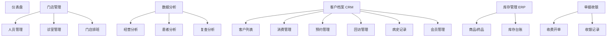
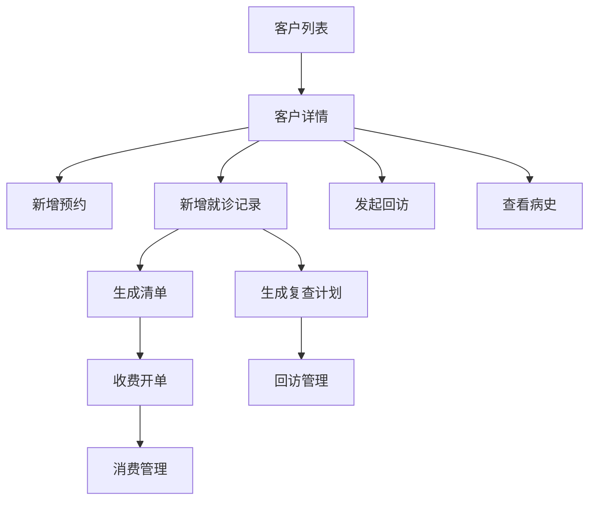

# Admin 页面清单与页面级原型说明

## 1. 文档说明

本文件基于以下文档继续细化：

1. `新CRM正式PRD.md`
2. `新CRM正式PRD-Admin骨架适配版.md`

本文件目标是把需求推进到“页面原型说明”层，便于后续：

1. 产品画原型
2. 前端拆页面
3. 后端拆接口
4. 设计评审时统一页面认知

本文件重点覆盖：

1. Admin 一级菜单与二级菜单页面清单
2. 每个页面的定位、结构、字段、操作、交互说明
3. 重点说明 `客户档案(CRM)` 的页面原型要求
4. 说明跨模块跳转关系

## 2. 原型设计总原则

## 2.1 总体原则

1. 保留现有 Admin 骨架菜单结构不大改。
2. 保留旧系统核心业务字段不变。
3. 重点优化录入效率、查看效率、跳转效率。
4. 所有业务围绕“患者主档案”统一组织。

## 2.2 页面交互原则

1. 列表页优先支持筛选、排序、快捷操作。
2. 详情页优先支持分栏、标签页、时间轴。
3. 新增/编辑页优先使用抽屉或分步表单。
4. 页面之间尽量减少完全跳转，优先保留上下文。
5. 所有核心操作应可从患者上下文中直接发起。

## 2.3 统一组件规范

建议全系统统一以下页面组件：

1. 顶部筛选栏
2. 列表表格
3. 批量操作栏
4. 右侧详情抽屉
5. 固定底部操作条
6. 时间轴组件
7. 状态标签
8. 操作日志区块

## 3. Admin 整体信息架构

## 3.1 一级菜单结构

## 3.2 页面优先级

### P0 页面

1. 仪表盘
2. 客户列表
3. 客户详情
4. 预约管理
5. 回访管理
6. 病史记录
7. 新增/编辑就诊记录

### P1 页面

1. 消费管理
2. 会员管理
3. 收费开单联动页
4. 数据分析首页

### P2 页面

1. 深度分析页
2. 套餐与复杂权益页
3. 高级库存联动页

## 4. 页面清单总览

| 一级菜单 | 二级菜单/页面 | 页面级别 | 优先级 |
|---|---|---|---|
| 仪表盘 | 经营总览页 | 一级页 | P0 |
| 门店管理 | 人员管理 | 列表页 | P1 |
| 门店管理 | 人员详情/编辑 | 详情/表单页 | P1 |
| 门店管理 | 诊室管理 | 列表页 | P1 |
| 门店管理 | 门店排班 | 日历/排班页 | P1 |
| 数据分析 | 经营分析 | 分析页 | P1 |
| 数据分析 | 患者分析 | 分析页 | P1 |
| 数据分析 | 复查分析 | 分析页 | P1 |
| 客户档案(CRM) | 客户列表 | 核心列表页 | P0 |
| 客户档案(CRM) | 客户详情 | 核心详情页 | P0 |
| 客户档案(CRM) | 新增患者 | 表单页 | P0 |
| 客户档案(CRM) | 编辑患者 | 表单页 | P0 |
| 客户档案(CRM) | 消费管理 | 列表页 | P1 |
| 客户档案(CRM) | 消费详情 | 详情页 | P1 |
| 客户档案(CRM) | 预约管理 | 核心列表页 | P0 |
| 客户档案(CRM) | 新增预约 | 抽屉/表单页 | P0 |
| 客户档案(CRM) | 回访管理 | 核心任务页 | P0 |
| 客户档案(CRM) | 回访记录详情 | 详情抽屉 | P0 |
| 客户档案(CRM) | 病史记录 | 核心详情页 | P0 |
| 客户档案(CRM) | 新增就诊记录 | 表单页 | P0 |
| 客户档案(CRM) | 会员管理 | 列表页 | P1 |
| 库存管理(ERP) | 商品/药品管理 | 列表页 | P2 |
| 库存管理(ERP) | 库存台账 | 列表页 | P2 |
| 单据收银 | 收费开单 | 表单页 | P1 |
| 单据收银 | 收银记录 | 列表页 | P1 |

## 5. 仪表盘

## 5.1 页面名称

`经营总览页`

## 5.2 页面目标

为管理员、门店负责人、运营人员快速展示经营与患者运营情况。

## 5.3 页面结构

1. 顶部筛选区
2. 核心经营卡片区
3. 预约与到诊趋势区
4. 患者与回访概况区
5. 快捷入口区

## 5.4 顶部筛选区

字段：

1. 门店选择
2. 时间范围
3. 统计口径

按钮：

1. 查询
2. 重置

## 5.5 核心经营卡片区

卡片建议：

1. 今日预约量
2. 今日到诊人数
3. 今日新增患者
4. 今日成交金额
5. 待回访人数
6. 本周复查到期人数

交互：

1. 每张卡片点击后跳到对应业务列表页。
2. 卡片显示环比或同比。

## 5.6 趋势图区

图表建议：

1. 预约趋势
2. 到诊趋势
3. 成交趋势
4. 回访完成趋势

## 5.7 快捷入口

建议入口：

1. 新增患者
2. 新增预约
3. 新增就诊记录
4. 发起回访
5. 发起收费

## 6. 门店管理

## 6.1 人员管理

### 页面目标

管理验光师、医生、前台、管理员等基础人员信息。

### 页面结构

1. 顶部筛选栏
2. 人员列表
3. 新增/编辑抽屉

### 列表字段

1. 员工编号
2. 姓名
3. 角色
4. 所属门店
5. 手机号
6. 状态
7. 排班情况
8. 操作

### 操作

1. 查看
2. 编辑
3. 停用
4. 查看排班

## 6.2 诊室管理

### 页面目标

管理门店诊室资源，为预约和接诊提供配置。

### 列表字段

1. 诊室名称
2. 所属门店
3. 诊室类型
4. 可用状态
5. 备注
6. 操作

## 6.3 门店排班

### 页面目标

管理门店可预约时间与接诊资源。

### 页面形态

1. 周视图排班表
2. 日视图排班表

### 核心字段

1. 日期
2. 班次
3. 门店
4. 诊室
5. 值班人员
6. 是否可预约

## 7. 数据分析

## 7.1 经营分析

### 页面目标

查看门店经营结果。

### 核心指标

1. 成交金额
2. 收费单数
3. 客单价
4. 套餐销售占比

## 7.2 患者分析

### 页面目标

查看患者增长与结构变化。

### 核心指标

1. 新增患者数
2. 活跃患者数
3. 首诊/复诊占比
4. 年龄段分布
5. 患者标签分布

## 7.3 复查分析

### 页面目标

查看回访与复查执行情况。

### 核心指标

1. 待复查人数
2. 已通知人数
3. 未通知人数
4. 复查到诊率
5. 回访完成率

## 8. 客户档案(CRM)

## 8.1 客户列表

### 页面定位

整个 CRM 的总入口和主工作台。

### 页面结构

1. 顶部筛选栏
2. 快捷统计栏
3. 患者列表表格
4. 批量操作栏
5. 右侧详情预览抽屉

### 顶部筛选栏字段

1. 关键词搜索
   - 支持姓名
   - 手机号
   - 患者编号
2. 最近就诊时间范围
3. 所属门店
4. 责任验光师
5. 跟进状态
6. 复查状态
7. 会员状态
8. 患者标签

按钮：

1. 查询
2. 重置
3. 高级筛选
4. 保存视图

### 快捷统计栏

建议显示：

1. 总患者数
2. 今日新增患者
3. 本周复诊患者
4. 待回访患者
5. 会员患者数

### 列表字段

必须保留字段：

1. 最近就诊时间
2. 患者姓名
3. 联系方式
4. 诊断
5. 主要治疗手段
6. 操作

建议扩展字段：

1. 患者编号
2. 性别
3. 年龄
4. 所属门店
5. 最近预约状态
6. 下次复查日期
7. 当前跟进状态
8. 患者标签
9. 会员状态

### 操作列

1. 查看详情
2. 新增就诊
3. 新建预约
4. 发起回访
5. 编辑
6. 删除/停用

### 交互说明

1. 行点击默认进入客户详情。
2. 鼠标悬浮手机号可展示最近联系记录。
3. 支持列拖拽和固定。
4. 支持多条件组合筛选。
5. 支持批量打标签、批量分配、批量回访。

## 8.2 新增患者

### 页面定位

为患者建档，同时开通小程序账号。

### 页面结构

1. 基本信息区
2. 联系方式区
3. 账号开通区
4. 归属信息区
5. 备注区
6. 固定底部操作栏

### 字段

1. 患者姓名
2. 性别
3. 出生日期
4. 手机号
5. 微信绑定状态
6. 所属门店
7. 责任验光师
8. 患者标签
9. 备注

### 按钮

1. 保存
2. 保存并新增预约
3. 保存并新增就诊
4. 取消

### 交互说明

1. 输入手机号时自动校验是否已存在。
2. 若手机号已存在，提示“去重建档/进入详情”。
3. 保存成功后可直接进入客户详情。

## 8.3 客户详情

### 页面定位

患者全生命周期总览页，是本系统核心页面。

### 页面结构

1. 顶部患者主信息卡
2. 左侧时间轴/导航区
3. 右侧主内容区
4. 顶部快捷操作区

### 顶部主信息卡字段

1. 姓名
2. 性别
3. 年龄
4. 联系方式
5. 患者编号
6. 所属门店
7. 责任验光师
8. 最近就诊时间
9. 下次复查日期
10. 会员状态
11. 患者标签

### 快捷操作

1. 新增预约
2. 新增就诊
3. 发起回访
4. 发起收费
5. 编辑档案

### 右侧标签页

1. 档案概览
2. 预约记录
3. 病史记录
4. 消费记录
5. 回访记录
6. 会员信息
7. 操作日志

### 交互说明

1. 头部固定展示，不随滚动消失。
2. 不同标签页切换不丢失患者上下文。
3. 从任何标签页都可发起核心业务动作。

## 8.4 预约管理

### 页面定位

管理患者预约全流程。

### 页面结构

1. 顶部筛选栏
2. 列表/日历视图切换
3. 预约列表
4. 预约详情抽屉
5. 新增预约抽屉

### 筛选字段

1. 日期范围
2. 时段
3. 患者姓名
4. 联系方式
5. 门店
6. 预约来源
7. 预约状态
8. 责任验光师

### 必须保留字段

1. 时段
2. 姓名
3. 联系方式
4. 用户标签
5. 问题
6. 解决方案
7. 备注
8. 预约状态

### 建议扩展字段

1. 预约编号
2. 门店
3. 诊室
4. 预约来源
5. 通知状态
6. 到诊状态
7. 创建人
8. 创建时间

### 行操作

1. 查看详情
2. 改期
3. 取消
4. 标记到诊
5. 标记爽约
6. 进入就诊录入

### 交互说明

1. 列表与日历视图切换不改变筛选条件。
2. 后台代预约时自动带出患者信息。
3. 支持快速复制预约。
4. 支持日历中直接点击空白时段发起预约。

## 8.5 新增预约

### 页面定位

患者预约和后台代预约的统一录入入口。

### 字段

1. 患者姓名/搜索患者
2. 联系方式
3. 所属门店
4. 预约日期
5. 预约时段
6. 预约诊室
7. 预约验光师
8. 问题描述
9. 解决方案预期
10. 备注

### 按钮

1. 保存预约
2. 保存并通知
3. 取消

## 8.6 回访管理

### 页面定位

复查回访任务中心。

### 页面结构

1. 顶部任务筛选区
2. 任务统计卡片
3. 回访任务列表
4. 跟进记录抽屉

### 筛选字段

1. 患者姓名
2. 联系方式
3. 最近就诊时间范围
4. 复查日期范围
5. 所属门店
6. 责任人
7. 回访状态

### 列表字段

1. 患者姓名
2. 联系方式
3. 最近就诊时间
4. 诊断
5. 主要治疗手段
6. 应复查日期
7. 回访状态
8. 最近通知时间
9. 跟进结果
10. 责任人

### 操作

1. 发起回访
2. 记录结果
3. 改期复查
4. 查看病史
5. 查看消费记录

### 交互说明

1. 默认按应复查日期升序。
2. 提供快捷筛选：今日待回访、逾期未回访、已完成。
3. 支持批量通知。
4. 支持标准话术模板。

## 8.7 病史记录

### 页面定位

眼科专业病史时间轴中心。

### 页面结构

1. 左侧就诊时间轴
2. 右侧记录详情
3. 顶部指标筛选区
4. 对比视图切换区

### 需保留的专业字段

1. 裸眼视力
2. 最佳矫正视力
3. 球镜
4. 柱镜
5. 轴位
6. SE
7. 角膜曲率
8. K1
9. K2
10. 眼轴
11. 轴率比
12. CRT
13. RNFL
14. 眼压
15. 角膜厚度
16. 角膜内皮计数
17. 立体视
18. 泪膜破裂时间
19. 泪液分泌试验

### 交互说明

1. 支持双眼/左眼/右眼切换。
2. 支持查看本次与上次差异。
3. 支持指标趋势对比。
4. 支持打印病史摘要。

## 8.8 新增就诊记录

### 页面定位

录入本次就诊检查、诊断、治疗与复查计划。

### 页面结构

1. 患者信息区
2. 就诊信息区
3. 检查数据区
4. 诊断结论区
5. 治疗方案区
6. 复查建议区
7. 清单/收费联动区
8. 固定底部操作栏

### 字段

1. 就诊日期
2. 接诊门店
3. 接诊验光师
4. 主诉
5. 检查数据
6. 诊断结论
7. 治疗方案
8. 推荐商品/套餐
9. 复查日期
10. 备注

### 按钮

1. 保存草稿
2. 保存
3. 保存并开单
4. 保存并发起回访计划
5. 取消

### 交互说明

1. 从客户详情发起时自动带患者信息。
2. 检查数据支持模板复用。
3. 支持自动生成复查任务。
4. 可直接联动生成收费清单。

## 8.9 消费管理

### 页面定位

查看患者消费、方案成交和收银结果。

### 页面结构

1. 顶部筛选栏
2. 消费列表
3. 消费详情抽屉

### 列表字段

1. 消费日期
2. 患者姓名
3. 联系方式
4. 消费项目
5. 原价
6. 折扣比例
7. 实付金额
8. 支付状态
9. 收银单号
10. 操作

### 操作

1. 查看详情
2. 查看清单
3. 查看对应病史
4. 跳转收银单

## 8.10 会员管理

### 页面定位

管理患者会员和套餐权益。

### 列表字段

1. 患者姓名
2. 联系方式
3. 会员等级
4. 套餐名称
5. 生效日期
6. 到期日期
7. 剩余次数/余额
8. 状态
9. 操作

### 操作

1. 查看详情
2. 激活
3. 续费/续期
4. 调整权益

## 9. 库存管理(ERP)

## 9.1 商品/药品管理

### 页面目标

提供清单、治疗方案和收银所需的商品/药品基础信息。

### 列表字段

1. 商品编码
2. 商品名称
3. 规格
4. 单位
5. 单价
6. 库存
7. 状态
8. 操作

## 9.2 库存台账

### 页面目标

查看商品、药品、耗材库存变化。

### 列表字段

1. 日期
2. 商品名称
3. 出入库类型
4. 数量
5. 关联单据
6. 操作人

## 10. 单据收银

## 10.1 收费开单

### 页面定位

承接就诊清单后的收费动作。

### 页面结构

1. 患者信息区
2. 单据项目区
3. 金额汇总区
4. 支付区

### 字段

1. 患者姓名
2. 联系方式
3. 单据编号
4. 项目列表
5. 原价
6. 折扣
7. 实收金额
8. 支付方式
9. 收费人
10. 备注

### 按钮

1. 确认收费
2. 暂存
3. 取消

## 10.2 收银记录

### 页面定位

查看所有收费记录。

### 列表字段

1. 收费时间
2. 患者姓名
3. 单据编号
4. 实收金额
5. 支付方式
6. 收费状态
7. 收费人
8. 操作

## 11. 页面跳转关系

## 11.1 CRM 主跳转链路

## 11.2 跨模块跳转要求

1. 从 `客户列表` 可直接进入 `客户详情`。
2. 从 `客户详情` 可直接发起预约、就诊、回访、收费。
3. 从 `预约管理` 的已到诊记录可直接进入 `新增就诊记录`。
4. 从 `新增就诊记录` 可直接进入 `收费开单`。
5. 从 `消费管理` 可回跳 `客户详情` 与 `病史记录`。
6. 从 `回访管理` 可回跳 `客户详情` 和 `病史记录`。

## 12. 原型阶段待补充说明

后续画原型时，建议重点先画以下页面：

1. 客户列表
2. 客户详情
3. 预约管理
4. 回访管理
5. 病史记录
6. 新增就诊记录

因为这 6 个页面决定了整个眼科 CRM 是否真正“好用”。

## 13. 结论

这份页面清单与页面级原型说明，已经把当前 Admin 骨架和新 CRM 需求真正连接起来。

后续如果继续深化，最适合直接往下做的是：

1. `客户档案(CRM) 字段字典与状态流转表`
2. `客户列表 / 客户详情 / 预约管理 / 回访管理 / 病史记录 / 新增就诊记录` 六个页面的高保真原型说明
