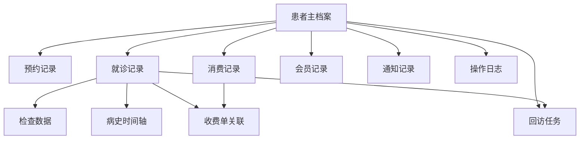

# 客户档案(CRM) 字段字典与状态流转表

## 1. 文档说明

本文件用于承接以下文档并进一步落地：

1. `新CRM正式PRD.md`
2. `新CRM正式PRD-Admin骨架适配版.md`
3. `Admin页面清单与页面级原型说明.md`

本文件目标是把 `客户档案(CRM)` 从“页面与模块定义”推进到“字段与状态定义”层，供以下角色协作使用：

1. 产品经理：统一字段口径与页面显示规则
2. 后端工程师：设计数据表、接口、状态机
3. 前端工程师：实现表单、列表、状态展示与状态流转操作
4. 测试工程师：设计状态流转测试用例
5. 数据迁移人员：对齐旧系统字段映射

## 2. 使用原则

## 2.1 字段设计原则

1. 原系统关键业务字段尽量保留不变。
2. 同一业务概念只保留一个主字段定义，避免页面各自命名不一致。
3. 页面展示字段可以裁剪，但底层主数据字段必须统一。
4. 所有对象统一采用主键 ID 管理，不直接以姓名或手机号做主键。

## 2.2 状态设计原则

1. 状态尽量少而清晰，避免多个近义状态混用。
2. 状态必须有明确触发动作。
3. 状态流转必须可留痕、可回溯。
4. 对患者可见状态与后台内部状态要区分。

## 2.3 字段列说明

本文字段字典中，统一使用以下列：

1. `字段名`：系统标准字段名，建议接口与数据库统一参考
2. `中文名`：产品和页面展示时使用
3. `类型`：String / Number / Boolean / Date / DateTime / Enum / JSON
4. `必填`：是否必填
5. `来源`：新建 / 旧系统迁移 / 系统计算 / 外部关联
6. `可编辑角色`：患者 / 验光师 / 管理员 / 系统
7. `显示页面`：字段在哪些页面展示
8. `说明`：业务口径说明

## 3. CRM 核心对象总览

`客户档案(CRM)` 建议围绕以下对象展开：

1. 患者主档案
2. 患者联系人/账号信息
3. 患者标签
4. 预约记录
5. 就诊记录
6. 检查数据
7. 病史时间轴
8. 回访/复查任务
9. 回访记录
10. 消费记录
11. 收费单关联
12. 会员记录
13. 通知记录
14. 操作日志

## 4. 对象关系图

## 5. 患者主档案字段字典

## 5.1 字段说明

患者主档案是 CRM 的中心对象，客户列表、客户详情、预约、病史、回访、消费、会员全部围绕它展开。

## 5.2 字段字典

| 字段名 | 中文名 | 类型 | 必填 | 来源 | 可编辑角色 | 显示页面 | 说明 |
|---|---|---|---|---|---|---|---|
| patient_id | 患者ID | String | 是 | 系统生成 | 系统 | 全部关联页 | 患者唯一主键 |
| patient_no | 患者编号 | String | 是 | 系统生成/迁移 | 系统/管理员 | 客户列表、客户详情 | 用于后台检索与标识 |
| name | 患者姓名 | String | 是 | 新建/迁移 | 验光师、管理员 | 客户列表、客户详情、预约、病史、回访、消费 | 主展示字段 |
| gender | 性别 | Enum | 否 | 新建/迁移 | 验光师、管理员 | 客户列表、客户详情 | 建议枚举：男/女/未知 |
| birthday | 出生日期 | Date | 否 | 新建/迁移 | 验光师、管理员 | 客户详情 | 用于年龄计算 |
| age | 年龄 | Number | 否 | 系统计算 | 系统 | 客户列表、客户详情 | 根据出生日期计算 |
| mobile | 联系方式 | String | 是 | 新建/迁移 | 验光师、管理员 | 客户列表、客户详情、预约、回访、消费 | 核心检索字段，重要去重依据 |
| wechat_open_id | 小程序绑定标识 | String | 否 | 外部绑定 | 系统 | 客户详情 | 小程序账号关联标识 |
| wechat_bind_status | 微信绑定状态 | Enum | 否 | 系统计算 | 系统 | 客戶详情 | 未绑定/已绑定 |
| source_type | 来源类型 | Enum | 是 | 新建/迁移 | 系统/管理员 | 客户详情、数据分析 | 小程序注册/后台代注册/历史迁移 |
| first_visit_date | 首诊日期 | Date | 否 | 系统计算/迁移 | 系统 | 客户详情 | 首次就诊日期 |
| latest_visit_date | 最近就诊时间 | DateTime | 否 | 系统计算/迁移 | 系统 | 客户列表、客户详情 | 重要排序字段 |
| latest_appointment_status | 最近预约状态 | Enum | 否 | 系统计算 | 系统 | 客户列表、客户详情 | 取最新预约的状态 |
| latest_diagnosis | 最新诊断 | String | 否 | 系统计算/迁移 | 系统 | 客户列表、客户详情 | 取最近一次就诊诊断摘要 |
| latest_treatment_method | 主要治疗手段 | String | 否 | 系统计算/迁移 | 系统 | 客户列表、客户详情 | 取最近一次治疗摘要 |
| next_review_date | 下次复查日期 | Date | 否 | 系统计算/迁移 | 系统/验光师 | 客户列表、客户详情、回访管理 | 取有效复查任务的最近日期 |
| follow_status | 跟进状态 | Enum | 否 | 系统计算/人工 | 验光师、管理员 | 客户列表、客户详情、回访管理 | 见状态字典 |
| patient_tags | 患者标签 | JSON | 否 | 新建/迁移/人工 | 验光师、管理员 | 客户列表、客户详情 | 可多选标签 |
| primary_store_id | 所属门店ID | String | 否 | 新建/迁移 | 验光师、管理员 | 客户列表、客户详情 | 默认归属门店 |
| primary_store_name | 所属门店 | String | 否 | 外部关联 | 系统 | 客户列表、客户详情 | 门店展示名 |
| owner_staff_id | 责任验光师ID | String | 否 | 新建/迁移 | 验光师、管理员 | 客户列表、客户详情、回访管理 | 当前主要责任人 |
| owner_staff_name | 责任验光师 | String | 否 | 外部关联 | 系统 | 客户列表、客户详情、回访管理 | 责任人展示名 |
| member_status | 会员状态 | Enum | 否 | 系统计算 | 系统 | 客户列表、客户详情、会员管理 | 非会员/生效中/已过期/已停用 |
| remark | 备注 | String | 否 | 新建/迁移 | 验光师、管理员 | 客户详情 | 自由文本备注 |
| is_active | 是否启用 | Boolean | 是 | 系统默认 | 管理员 | 客户详情、后台管理 | 逻辑启停状态 |
| created_at | 创建时间 | DateTime | 是 | 系统生成 | 系统 | 客户详情、操作日志 | 建档时间 |
| created_by | 创建人 | String | 是 | 系统生成 | 系统 | 客户详情、操作日志 | 创建操作者 |
| updated_at | 更新时间 | DateTime | 是 | 系统生成 | 系统 | 客户详情、操作日志 | 最近修改时间 |

## 5.3 患者标签建议字典

建议标签支持多选，初期可配置但不宜过多。

| 标签编码 | 标签名称 | 说明 |
|---|---|---|
| first_visit | 首诊患者 | 首次到店 |
| return_visit | 复诊患者 | 多次就诊 |
| ok_lens | OK镜 | 与角膜塑形镜相关 |
| defocus_lens | 离焦镜片 | 与离焦类方案相关 |
| dry_eye | 干眼 | 干眼相关人群 |
| high_follow | 高关注 | 需要重点跟进 |
| member_user | 会员用户 | 有会员权益 |
| unpaid_plan | 方案未成交 | 有方案未成交 |

## 6. 患者主档案状态流转

## 6.1 主档案状态定义

这里不单独定义复杂“患者状态机”，建议以 `follow_status` 作为运营状态，以 `is_active` 作为档案启停状态。

### follow_status 字典

| 状态值 | 中文名 | 说明 |
|---|---|---|
| new | 新建档 | 刚建档，未预约未就诊 |
| booked | 已预约 | 已有有效预约 |
| visited | 已就诊 | 已产生至少一次就诊记录 |
| under_followup | 跟进中 | 有回访或复查任务在跟进 |
| waiting_review | 待复查 | 已到或临近复查时间 |
| completed_review | 复查完成 | 相关复查任务已完成 |
| lost_followup | 暂失联/流失 | 多次未到诊或未回访成功 |

## 6.2 follow_status 流转表

| 当前状态 | 触发动作 | 下一状态 | 备注 |
|---|---|---|---|
| new | 创建预约 | booked | 患者或后台代预约 |
| new | 新增首诊记录 | visited | 直接到诊并录入 |
| booked | 标记到诊并生成就诊记录 | visited | 完成首诊或复诊接诊 |
| visited | 设置复查日期并生成任务 | under_followup | 有后续跟进计划 |
| under_followup | 到达复查窗口 | waiting_review | 系统根据复查日期切换 |
| waiting_review | 完成复查并录入新就诊 | completed_review | 当前复查闭环完成 |
| completed_review | 再次产生新预约 | booked | 进入新一轮服务 |
| 任意状态 | 多次未联系成功且人工标记 | lost_followup | 后台人工确认 |
| lost_followup | 再次预约或到诊 | booked / visited | 可重新激活 |

## 7. 预约记录字段字典

## 7.1 业务说明

预约记录覆盖：

1. 患者小程序预约
2. 后台代预约
3. 门店排班下的预约资源占用

## 7.2 字段字典

| 字段名 | 中文名 | 类型 | 必填 | 来源 | 可编辑角色 | 显示页面 | 说明 |
|---|---|---|---|---|---|---|---|
| appointment_id | 预约ID | String | 是 | 系统生成 | 系统 | 预约管理、客户详情 | 预约主键 |
| appointment_no | 预约编号 | String | 是 | 系统生成 | 系统 | 预约管理、详情 | 业务编号 |
| patient_id | 患者ID | String | 是 | 外部关联 | 系统 | 预约管理、详情 | 关联患者 |
| patient_name | 患者姓名 | String | 是 | 外部关联 | 系统 | 预约管理 | 冗余展示字段 |
| mobile | 联系方式 | String | 是 | 外部关联/人工 | 验光师、管理员 | 预约管理 | 便于联系 |
| appointment_date | 预约日期 | Date | 是 | 新建 | 验光师、管理员、患者 | 预约管理、客户详情、小程序 | 预约日期 |
| appointment_period | 时段 | String | 是 | 新建 | 验光师、管理员、患者 | 预约管理、小程序 | 如上午/下午/具体时间段 |
| appointment_time_start | 开始时间 | DateTime | 否 | 新建/排班生成 | 验光师、管理员、系统 | 预约管理 | 精确开始时间 |
| appointment_time_end | 结束时间 | DateTime | 否 | 新建/排班生成 | 验光师、管理员、系统 | 预约管理 | 精确结束时间 |
| store_id | 门店ID | String | 是 | 新建 | 验光师、管理员、患者 | 预约管理、小程序 | 预约门店 |
| store_name | 门店名称 | String | 是 | 外部关联 | 系统 | 预约管理、小程序 | 门店展示名 |
| room_id | 诊室ID | String | 否 | 新建/排班选择 | 验光师、管理员 | 预约管理 | 预约诊室 |
| room_name | 诊室名称 | String | 否 | 外部关联 | 系统 | 预约管理 | 诊室展示名 |
| staff_id | 预约验光师ID | String | 否 | 新建 | 验光师、管理员、患者 | 预约管理 | 预约责任人 |
| staff_name | 预约验光师 | String | 否 | 外部关联 | 系统 | 预约管理 | 展示名 |
| source_type | 预约来源 | Enum | 是 | 新建 | 系统 | 预约管理、分析 | 小程序预约/后台代预约/现场加号 |
| patient_tags | 用户标签 | JSON | 否 | 外部关联 | 系统/验光师 | 预约管理 | 从患者档案同步，可补充 |
| issue_desc | 问题 | String | 否 | 新建/迁移 | 验光师、管理员、患者 | 预约管理 | 来诊问题描述 |
| solution_expectation | 解决方案 | String | 否 | 新建/迁移 | 验光师、管理员 | 预约管理 | 旧系统中保留的字段 |
| remark | 备注 | String | 否 | 新建/迁移 | 验光师、管理员 | 预约管理 | 预约备注 |
| notification_status | 通知状态 | Enum | 否 | 系统计算 | 系统 | 预约管理 | 是否已发送通知 |
| appointment_status | 预约状态 | Enum | 是 | 系统/人工 | 验光师、管理员、系统 | 预约管理、小程序 | 见状态字典 |
| arrival_status | 到诊状态 | Enum | 否 | 系统/人工 | 验光师、管理员 | 预约管理 | 未到诊/已到诊 |
| created_by | 创建人 | String | 是 | 系统生成 | 系统 | 预约管理 | 患者本人或后台人员 |
| created_role | 创建角色 | Enum | 是 | 系统生成 | 系统 | 预约管理 | 患者/验光师/管理员 |
| created_at | 创建时间 | DateTime | 是 | 系统生成 | 系统 | 预约管理 | 创建时间 |
| updated_at | 更新时间 | DateTime | 是 | 系统生成 | 系统 | 预约管理 | 更新时间 |

## 7.3 预约状态字典

| 状态值 | 中文名 | 说明 |
|---|---|---|
| pending | 待确认 | 刚创建，尚未完成确认 |
| confirmed | 已确认 | 预约有效 |
| arrived | 已到诊 | 患者到店签到/到诊 |
| in_service | 就诊中 | 已开始接诊但记录未结束 |
| completed | 已完成 | 本次预约就诊完成 |
| cancelled | 已取消 | 主动取消 |
| no_show | 已爽约 | 预约未到诊 |
| rescheduled | 已改期 | 原预约已被改到其他时间 |

## 7.4 预约状态流转表

| 当前状态 | 触发动作 | 下一状态 | 备注 |
|---|---|---|---|
| pending | 审核或自动确认 | confirmed | 小程序预约或后台代预约 |
| confirmed | 患者到店签到 | arrived | 进入接诊准备 |
| arrived | 开始就诊 | in_service | 创建就诊上下文 |
| in_service | 完成就诊记录 | completed | 生成或关联就诊记录 |
| pending / confirmed | 主动取消 | cancelled | 患者或后台取消 |
| confirmed | 超过预约时间未到诊并人工确认 | no_show | 爽约 |
| pending / confirmed | 改期成功 | rescheduled | 原单结束，通常新建一条预约 |
| no_show | 重新预约 | pending / confirmed | 新建预约，不回滚原记录 |

## 8. 就诊记录字段字典

## 8.1 业务说明

就诊记录是患者病史、诊断、治疗、清单、回访的核心来源对象。

## 8.2 字段字典

| 字段名 | 中文名 | 类型 | 必填 | 来源 | 可编辑角色 | 显示页面 | 说明 |
|---|---|---|---|---|---|---|---|
| visit_id | 就诊记录ID | String | 是 | 系统生成 | 系统 | 病史记录、客户详情 | 主键 |
| visit_no | 就诊记录编号 | String | 是 | 系统生成 | 系统 | 病史记录、收费关联 | 业务编号 |
| patient_id | 患者ID | String | 是 | 外部关联 | 系统 | 全部就诊相关页 | 关联患者 |
| appointment_id | 预约ID | String | 否 | 外部关联 | 系统 | 病史记录、预约管理 | 关联预约 |
| visit_date | 就诊时间 | DateTime | 是 | 新建/迁移 | 验光师、管理员 | 病史记录、客户详情 | 就诊发生时间 |
| visit_type | 就诊类型 | Enum | 否 | 新建/迁移 | 验光师、管理员 | 病史记录 | 首诊/复诊/复查 |
| store_id | 接诊门店ID | String | 是 | 新建/迁移 | 验光师、管理员 | 病史记录、客户详情 | 接诊门店 |
| store_name | 接诊门店 | String | 是 | 外部关联 | 系统 | 病史记录、客户详情 | 展示字段 |
| staff_id | 接诊验光师ID | String | 是 | 新建/迁移 | 验光师、管理员 | 病史记录 | 接诊责任人 |
| staff_name | 接诊验光师 | String | 是 | 外部关联 | 系统 | 病史记录 | 展示字段 |
| chief_complaint | 主诉 | String | 否 | 新建/迁移 | 验光师、管理员 | 病史记录、客户详情 | 主要问题 |
| diagnosis | 诊断结论 | String | 否 | 新建/迁移 | 验光师、管理员 | 客户列表、病史记录、回访管理 | 核心摘要字段 |
| treatment_method | 主要治疗手段 | String | 否 | 新建/迁移 | 验光师、管理员 | 客户列表、病史记录、回访管理 | 核心摘要字段 |
| treatment_plan | 治疗方案 | String | 否 | 新建/迁移 | 验光师、管理员 | 病史记录、客户详情 | 详细方案 |
| product_recommendation | 推荐商品/套餐 | String | 否 | 新建/迁移 | 验光师、管理员 | 病史记录、消费管理 | 与消费联动 |
| review_date | 建议复查日期 | Date | 否 | 新建/迁移 | 验光师、管理员 | 病史记录、回访管理 | 可生成回访任务 |
| visit_status | 就诊记录状态 | Enum | 是 | 系统/人工 | 验光师、管理员、系统 | 病史记录 | 草稿/已完成/已归档等 |
| summary | 就诊摘要 | String | 否 | 系统计算/人工 | 验光师、管理员 | 客户详情 | 供快速浏览 |
| remark | 备注 | String | 否 | 新建/迁移 | 验光师、管理员 | 病史记录 | 自由备注 |
| linked_bill_id | 关联收费单ID | String | 否 | 外部关联 | 系统 | 病史记录、消费管理 | 关联收费流程 |
| created_at | 创建时间 | DateTime | 是 | 系统生成 | 系统 | 病史记录、日志 | 创建时间 |
| created_by | 创建人 | String | 是 | 系统生成 | 系统 | 病史记录、日志 | 创建操作者 |
| updated_at | 更新时间 | DateTime | 是 | 系统生成 | 系统 | 病史记录、日志 | 更新时间 |

## 8.3 就诊记录状态字典

| 状态值 | 中文名 | 说明 |
|---|---|---|
| draft | 草稿 | 正在录入，尚未提交 |
| completed | 已完成 | 已提交，记录完整 |
| archived | 已归档 | 已稳定保存并纳入病史 |
| voided | 已作废 | 错误记录或撤销 |

## 8.4 就诊记录状态流转表

| 当前状态 | 触发动作 | 下一状态 | 备注 |
|---|---|---|---|
| 无 | 新建就诊记录 | draft | 可从预约或客户详情发起 |
| draft | 保存并提交 | completed | 录入完成 |
| completed | 系统病史归档处理 | archived | 归入时间轴，供长期查询 |
| draft / completed | 作废 | voided | 需权限和日志 |
| voided | 恢复并重新编辑 | draft | 可选，需管理员权限 |

## 9. 检查数据字段字典

## 9.1 业务说明

检查数据属于就诊记录的明细层，是眼科专业病史的核心。

## 9.2 建议数据模型

建议采用“标准字段 + 扩展 JSON”的形式。

1. 高频标准字段进入独立字段，方便列表、筛选、对比、分析。
2. 低频或设备差异字段进入 `raw_metrics` JSON。

## 9.3 字段字典

| 字段名 | 中文名 | 类型 | 必填 | 来源 | 可编辑角色 | 显示页面 | 说明 |
|---|---|---|---|---|---|---|---|
| exam_id | 检查数据ID | String | 是 | 系统生成 | 系统 | 病史记录 | 主键 |
| visit_id | 就诊记录ID | String | 是 | 外部关联 | 系统 | 病史记录 | 所属就诊 |
| exam_type | 检查类型 | Enum | 是 | 新建/迁移 | 验光师、管理员 | 病史记录 | 验光/视力/眼轴/问卷等 |
| od_va | 右眼裸眼视力 | Number/String | 否 | 新建/迁移 | 验光师 | 病史记录、分析 | 可按设备实际格式 |
| os_va | 左眼裸眼视力 | Number/String | 否 | 新建/迁移 | 验光师 | 病史记录、分析 | 同上 |
| od_bcva | 右眼最佳矫正视力 | Number/String | 否 | 新建/迁移 | 验光师 | 病史记录、分析 |  |
| os_bcva | 左眼最佳矫正视力 | Number/String | 否 | 新建/迁移 | 验光师 | 病史记录、分析 |  |
| od_sphere | 右眼球镜 | Number | 否 | 新建/迁移 | 验光师 | 病史记录、分析 |  |
| od_cylinder | 右眼柱镜 | Number | 否 | 新建/迁移 | 验光师 | 病史记录、分析 |  |
| od_axis | 右眼轴位 | Number | 否 | 新建/迁移 | 验光师 | 病史记录、分析 |  |
| os_sphere | 左眼球镜 | Number | 否 | 新建/迁移 | 验光师 | 病史记录、分析 |  |
| os_cylinder | 左眼柱镜 | Number | 否 | 新建/迁移 | 验光师 | 病史记录、分析 |  |
| os_axis | 左眼轴位 | Number | 否 | 新建/迁移 | 验光师 | 病史记录、分析 |  |
| se | SE | Number | 否 | 系统计算/迁移 | 系统/验光师 | 病史记录、分析 | 等效球镜 |
| k1 | K1 | Number | 否 | 新建/迁移 | 验光师 | 病史记录、分析 | 角膜曲率 |
| k2 | K2 | Number | 否 | 新建/迁移 | 验光师 | 病史记录、分析 | 角膜曲率 |
| axial_length | 眼轴 | Number | 否 | 新建/迁移 | 验光师 | 病史记录、分析 | 重要核心指标 |
| axial_ratio | 轴率比 | Number | 否 | 新建/迁移 | 验光师 | 病史记录、分析 |  |
| crt | CRT | Number | 否 | 新建/迁移 | 验光师 | 病史记录、分析 |  |
| rnfl | RNFL | Number | 否 | 新建/迁移 | 验光师 | 病史记录、分析 |  |
| iop | 眼压 | Number | 否 | 新建/迁移 | 验光师 | 病史记录、分析 |  |
| corneal_thickness | 角膜厚度 | Number | 否 | 新建/迁移 | 验光师 | 病史记录、分析 |  |
| endothelial_count | 角膜内皮计数 | Number | 否 | 新建/迁移 | 验光师 | 病史记录、分析 |  |
| stereo_vision | 立体视 | String/Number | 否 | 新建/迁移 | 验光师 | 病史记录 |  |
| tbut | 泪膜破裂时间 | Number | 否 | 新建/迁移 | 验光师 | 病史记录 |  |
| schirmer | 泪液分泌试验 | Number | 否 | 新建/迁移 | 验光师 | 病史记录 |  |
| questionnaire_score | 问卷得分 | Number | 否 | 新建/迁移 | 验光师 | 病史记录、问卷记录 | 问卷场景使用 |
| questionnaire_result | 问卷评价 | String | 否 | 新建/迁移 | 验光师 | 病史记录、问卷记录 | 如正常/异常 |
| raw_metrics | 扩展指标 | JSON | 否 | 新建/迁移 | 验光师、系统 | 病史记录 | 设备或特殊项目扩展 |
| remark | 检查备注 | String | 否 | 新建/迁移 | 验光师 | 病史记录 |  |

## 10. 病史时间轴展示字段

病史时间轴本质上基于就诊记录和检查数据生成，不一定独立落库，但前端展示需要统一口径。

| 字段名 | 中文名 | 来源对象 | 说明 |
|---|---|---|---|
| timeline_id | 时间轴项ID | visit_id | 可直接复用就诊记录ID |
| timeline_date | 就诊日期 | 就诊记录 | 左侧时间轴主显示 |
| timeline_title | 时间轴标题 | 系统拼装 | 如“2026-05-01 首诊” |
| diagnosis_summary | 诊断摘要 | 就诊记录 | 时间轴摘要 |
| treatment_summary | 治疗摘要 | 就诊记录 | 时间轴摘要 |
| review_date | 复查日期 | 就诊记录/回访任务 | 时间轴摘要 |
| bill_status | 收费状态 | 收费单 | 时间轴摘要 |

## 11. 回访/复查任务字段字典

## 11.1 业务说明

回访管理需要从旧 CRM 的“回访管理”升级为任务制，围绕复查日期、通知动作、跟进结果展开。

## 11.2 字段字典

| 字段名 | 中文名 | 类型 | 必填 | 来源 | 可编辑角色 | 显示页面 | 说明 |
|---|---|---|---|---|---|---|---|
| review_task_id | 回访任务ID | String | 是 | 系统生成 | 系统 | 回访管理、客户详情 | 主键 |
| patient_id | 患者ID | String | 是 | 外部关联 | 系统 | 回访管理 | 关联患者 |
| visit_id | 来源就诊记录ID | String | 是 | 外部关联 | 系统 | 回访管理、病史记录 | 来源记录 |
| task_type | 任务类型 | Enum | 是 | 系统/人工 | 验光师、管理员 | 回访管理 | 复查提醒/普通回访/异常跟进 |
| diagnosis | 诊断 | String | 否 | 外部同步 | 系统 | 回访管理 | 冗余展示 |
| treatment_method | 主要治疗手段 | String | 否 | 外部同步 | 系统 | 回访管理 | 冗余展示 |
| review_date | 应复查日期 | Date | 是 | 新建/迁移 | 验光师、管理员 | 回访管理 | 任务核心日期 |
| owner_staff_id | 责任人ID | String | 否 | 新建/系统分配 | 验光师、管理员 | 回访管理 | 当前负责人 |
| owner_staff_name | 责任人 | String | 否 | 外部关联 | 系统 | 回访管理 | 展示字段 |
| task_status | 任务状态 | Enum | 是 | 系统/人工 | 验光师、管理员、系统 | 回访管理 | 见状态字典 |
| latest_contact_time | 最近联系时间 | DateTime | 否 | 系统/人工 | 系统/验光师 | 回访管理 | 最近一次跟进时间 |
| latest_contact_result | 最近跟进结果 | Enum | 否 | 人工 | 验光师、管理员 | 回访管理 | 见结果字典 |
| notify_count | 通知次数 | Number | 否 | 系统计算 | 系统 | 回访管理 | 统计发送次数 |
| next_follow_date | 下次跟进日期 | Date | 否 | 人工 | 验光师、管理员 | 回访管理 | 若需要再次联系 |
| close_reason | 关闭原因 | String | 否 | 人工 | 验光师、管理员 | 回访管理 | 完成/无效等原因 |
| remark | 备注 | String | 否 | 人工 | 验光师、管理员 | 回访管理 | 自由备注 |
| created_at | 创建时间 | DateTime | 是 | 系统生成 | 系统 | 回访管理 | 创建时间 |
| updated_at | 更新时间 | DateTime | 是 | 系统生成 | 系统 | 回访管理 | 更新时间 |

## 11.3 回访任务状态字典

| 状态值 | 中文名 | 说明 |
|---|---|---|
| pending | 待跟进 | 已生成任务，尚未联系 |
| notifying | 通知中 | 正在发送或刚发送通知 |
| contacted | 已联系 | 已与患者建立联系 |
| waiting_visit | 待复查到店 | 患者已确认，将到店复查 |
| completed | 已完成 | 已完成回访目标或复查闭环 |
| invalid | 无效关闭 | 无需继续跟进 |
| overdue | 已逾期 | 超过计划日期仍未完成 |

## 11.4 回访任务状态流转表

| 当前状态 | 触发动作 | 下一状态 | 备注 |
|---|---|---|---|
| 无 | 根据就诊记录生成复查任务 | pending | 就诊保存后生成 |
| pending | 发送通知/拨打电话 | notifying | 开始联系 |
| notifying | 联系成功并有反馈 | contacted | 有明确触达结果 |
| contacted | 患者确认来院复查 | waiting_visit | 等待复查到店 |
| waiting_visit | 复查到店并产生新就诊 | completed | 闭环完成 |
| pending / notifying / contacted | 超过应复查日期 | overdue | 系统自动或任务批处理 |
| overdue | 成功联系并确认复查 | waiting_visit | 逾期后重新激活 |
| pending / notifying / contacted / overdue | 人工判定无需继续 | invalid | 需记录原因 |
| 任意未关闭状态 | 人工确认本次任务结束 | completed | 如已电话完成指导 |

## 11.5 跟进结果字典

| 结果值 | 中文名 | 说明 |
|---|---|---|
| no_answer | 未接通 | 电话未接通 |
| contacted | 已联系上 | 联系成功 |
| agreed_review | 同意复查 | 已约定复查 |
| refused | 暂不复查 | 拒绝或延期 |
| wrong_number | 号码错误 | 联系信息失效 |
| lost_contact | 无法联系 | 多次联系失败 |
| completed_by_visit | 已到店复查 | 已完成目标 |

## 12. 回访记录字段字典

说明：回访任务是主对象，回访记录是每次联系动作的流水。

| 字段名 | 中文名 | 类型 | 必填 | 来源 | 可编辑角色 | 显示页面 | 说明 |
|---|---|---|---|---|---|---|---|
| follow_record_id | 回访记录ID | String | 是 | 系统生成 | 系统 | 回访详情、客户详情 | 主键 |
| review_task_id | 回访任务ID | String | 是 | 外部关联 | 系统 | 回访详情 | 所属任务 |
| patient_id | 患者ID | String | 是 | 外部关联 | 系统 | 回访详情 | 关联患者 |
| contact_time | 联系时间 | DateTime | 是 | 系统/人工 | 验光师、管理员 | 回访详情 | 实际联系时间 |
| contact_channel | 联系方式 | Enum | 是 | 人工 | 验光师、管理员 | 回访详情 | 电话/小程序通知/微信/到店沟通 |
| contact_result | 联系结果 | Enum | 是 | 人工 | 验光师、管理员 | 回访详情 | 见字典 |
| content | 跟进内容 | String | 否 | 人工 | 验光师、管理员 | 回访详情 | 本次沟通摘要 |
| next_action | 下步动作 | String | 否 | 人工 | 验光师、管理员 | 回访详情 | 如再次联系、等待到店 |
| next_follow_date | 下次跟进日期 | Date | 否 | 人工 | 验光师、管理员 | 回访详情 | 下次动作时间 |
| operator_id | 操作人ID | String | 是 | 系统生成 | 系统 | 回访详情 | 谁进行了联系 |
| operator_name | 操作人 | String | 是 | 系统生成 | 系统 | 回访详情 | 展示名 |

## 13. 消费记录字段字典

## 13.1 业务说明

消费记录承接旧系统中“方案情况、成交折扣比例”等核心业务信息，并与单据收银联动。

## 13.2 字段字典

| 字段名 | 中文名 | 类型 | 必填 | 来源 | 可编辑角色 | 显示页面 | 说明 |
|---|---|---|---|---|---|---|---|
| consumption_id | 消费记录ID | String | 是 | 系统生成 | 系统 | 消费管理、客户详情 | 主键 |
| patient_id | 患者ID | String | 是 | 外部关联 | 系统 | 消费管理 | 关联患者 |
| visit_id | 就诊记录ID | 否 | 外部关联 | 系统 | 消费管理、病史记录 | 来源就诊 |
| bill_id | 收费单ID | 否 | 外部关联 | 系统 | 消费管理、收银记录 | 收银联动 |
| consumption_date | 消费日期 | DateTime | 是 | 系统/迁移 | 系统/管理员 | 消费管理 | 业务发生时间 |
| plan_summary | 方案情况 | String | 否 | 新建/迁移 | 验光师、管理员 | 消费管理、客户详情 | 旧系统要求保留 |
| discount_rate | 成交折扣比例 | Number | 否 | 新建/迁移 | 验光师、管理员 | 消费管理 | 旧系统要求保留 |
| item_summary | 消费项目 | String | 否 | 新建/迁移 | 验光师、管理员 | 消费管理 | 项目摘要 |
| original_amount | 原价金额 | Number | 否 | 系统/人工 | 验光师、管理员 | 消费管理、收银 | 原价 |
| discount_amount | 优惠金额 | Number | 否 | 系统计算/人工 | 验光师、管理员 | 消费管理、收银 | 优惠值 |
| paid_amount | 实付金额 | Number | 否 | 收银回写/迁移 | 系统 | 消费管理、收银 | 实收金额 |
| payment_status | 支付状态 | Enum | 是 | 系统/人工 | 管理员、系统 | 消费管理、收银 | 未支付/部分支付/已支付/已退款 |
| payment_method | 支付方式 | Enum | 否 | 收银回写/迁移 | 系统/管理员 | 消费管理、收银 | 现金/微信/支付宝/银行卡等 |
| cashier_staff_id | 收费人ID | String | 否 | 外部关联 | 系统 | 消费管理、收银 | 收费操作人 |
| cashier_staff_name | 收费人 | String | 否 | 外部关联 | 系统 | 消费管理、收银 | 展示名 |
| remark | 备注 | String | 否 | 新建/迁移 | 验光师、管理员 | 消费管理 | 备注 |
| created_at | 创建时间 | DateTime | 是 | 系统生成 | 系统 | 消费管理 | 创建时间 |

## 13.3 支付状态字典

| 状态值 | 中文名 | 说明 |
|---|---|---|
| unpaid | 未支付 | 已有消费单但未付款 |
| partial_paid | 部分支付 | 多次支付场景 |
| paid | 已支付 | 已完成付款 |
| refunded | 已退款 | 已发生退款 |
| closed | 已关闭 | 不再继续收款 |

## 13.4 支付状态流转表

| 当前状态 | 触发动作 | 下一状态 | 备注 |
|---|---|---|---|
| 无 | 生成消费记录/开单 | unpaid | 待付款 |
| unpaid | 收到部分付款 | partial_paid | 多笔支付 |
| unpaid / partial_paid | 收齐款项 | paid | 完成付款 |
| paid | 发起退款并成功 | refunded | 售后或撤销 |
| unpaid / partial_paid | 放弃收款并关闭 | closed | 人工关闭 |
| closed | 重新开启收费 | unpaid | 可选，需权限 |

## 14. 会员记录字段字典

## 14.1 业务说明

会员管理保留为轻量版本，但需和患者主档案、消费、套餐权益关联。

## 14.2 字段字典

| 字段名 | 中文名 | 类型 | 必填 | 来源 | 可编辑角色 | 显示页面 | 说明 |
|---|---|---|---|---|---|---|---|
| membership_id | 会员记录ID | String | 是 | 系统生成 | 系统 | 会员管理、客户详情 | 主键 |
| patient_id | 患者ID | String | 是 | 外部关联 | 系统 | 会员管理 | 关联患者 |
| member_no | 会员编号 | String | 否 | 系统生成/迁移 | 系统 | 会员管理 | 会员编码 |
| member_level | 会员等级 | Enum | 否 | 新建/迁移 | 管理员 | 会员管理、客户详情 | 普通/银卡/金卡等 |
| package_name | 套餐名称 | String | 否 | 新建/迁移 | 管理员 | 会员管理、客户详情 | 套餐名 |
| valid_from | 生效日期 | Date | 否 | 新建/迁移 | 管理员 | 会员管理 | 生效开始时间 |
| valid_to | 到期日期 | Date | 否 | 新建/迁移 | 管理员 | 会员管理 | 结束时间 |
| remaining_times | 剩余次数 | Number | 否 | 系统计算/迁移 | 系统/管理员 | 会员管理、客户详情 | 次卡场景 |
| balance_amount | 剩余余额 | Number | 否 | 系统计算/迁移 | 系统/管理员 | 会员管理、客户详情 | 储值场景 |
| membership_status | 会员状态 | Enum | 是 | 系统/人工 | 管理员、系统 | 会员管理、客户详情 | 见状态字典 |
| activated_at | 激活时间 | DateTime | 否 | 系统/人工 | 管理员、系统 | 会员管理 | 激活时间 |
| remark | 备注 | String | 否 | 人工 | 管理员 | 会员管理 | 备注 |

## 14.3 会员状态字典

| 状态值 | 中文名 | 说明 |
|---|---|---|
| inactive | 未激活 | 已建会员记录但未生效 |
| active | 生效中 | 当前可使用 |
| expiring | 即将到期 | 临近有效期结束 |
| expired | 已过期 | 已超过有效期 |
| suspended | 已停用 | 人工冻结 |
| exhausted | 次数/余额耗尽 | 已不能继续使用 |

## 14.4 会员状态流转表

| 当前状态 | 触发动作 | 下一状态 | 备注 |
|---|---|---|---|
| 无 | 创建会员记录 | inactive | 创建但未激活 |
| inactive | 激活 | active | 开始生效 |
| active | 临近到期阈值 | expiring | 系统自动标记 |
| active / expiring | 超过有效期 | expired | 系统自动处理 |
| active | 次数或余额耗尽 | exhausted | 系统自动或人工确认 |
| active / expiring | 人工停用 | suspended | 管理员操作 |
| suspended | 恢复使用 | active | 管理员恢复 |
| expired / exhausted | 续费或续期 | active | 重新激活 |

## 15. 通知记录字段字典

| 字段名 | 中文名 | 类型 | 必填 | 来源 | 可编辑角色 | 显示页面 | 说明 |
|---|---|---|---|---|---|---|---|
| notification_id | 通知记录ID | String | 是 | 系统生成 | 系统 | 预约管理、回访管理、客户详情 | 主键 |
| patient_id | 患者ID | String | 是 | 外部关联 | 系统 | 客户详情 | 关联患者 |
| business_type | 业务类型 | Enum | 是 | 系统/人工 | 系统/管理员 | 客户详情、回访管理 | 预约通知/复查通知/系统通知 |
| related_id | 关联业务ID | String | 否 | 外部关联 | 系统 | 详情页 | 预约ID/任务ID等 |
| channel | 发送渠道 | Enum | 是 | 系统/人工 | 系统/管理员 | 通知记录 | 小程序订阅消息/站内消息/人工电话等 |
| content | 通知内容 | String | 是 | 系统模板/人工 | 系统/管理员 | 通知记录 | 消息内容 |
| send_status | 发送状态 | Enum | 是 | 系统 | 系统 | 通知记录 | 待发送/已发送/失败 |
| send_time | 发送时间 | DateTime | 否 | 系统 | 系统 | 通知记录 | 实际时间 |
| operator_name | 操作人 | String | 否 | 系统/人工 | 系统 | 通知记录 | 谁触发了通知 |

## 16. 操作日志字段字典

| 字段名 | 中文名 | 类型 | 必填 | 来源 | 可编辑角色 | 显示页面 | 说明 |
|---|---|---|---|---|---|---|---|
| log_id | 日志ID | String | 是 | 系统生成 | 系统 | 客户详情、后台日志 | 主键 |
| patient_id | 患者ID | String | 否 | 外部关联 | 系统 | 客户详情 | 与患者有关的日志 |
| business_type | 业务类型 | Enum | 是 | 系统 | 系统 | 操作日志 | 档案/预约/就诊/回访/消费/会员 |
| business_id | 业务对象ID | String | 否 | 外部关联 | 系统 | 操作日志 | 关联对象 |
| action_type | 动作类型 | Enum | 是 | 系统 | 系统 | 操作日志 | 创建/修改/删除/状态变更/通知发送 |
| action_desc | 动作描述 | String | 是 | 系统 | 系统 | 操作日志 | 人类可读描述 |
| operator_id | 操作人ID | String | 是 | 系统 | 系统 | 操作日志 | 谁做的 |
| operator_name | 操作人 | String | 是 | 系统 | 系统 | 操作日志 | 展示名 |
| operate_time | 操作时间 | DateTime | 是 | 系统 | 系统 | 操作日志 | 时间戳 |

## 17. 页面字段映射

## 17.1 客户列表页面字段映射

| 页面字段 | 来源对象 | 来源字段 | 是否保留旧字段 | 说明 |
|---|---|---|---|---|
| 最近就诊时间 | 患者主档案 | latest_visit_date | 是 | 旧系统保留 |
| 患者姓名 | 患者主档案 | name | 是 | 旧系统保留 |
| 联系方式 | 患者主档案 | mobile | 是 | 旧系统保留 |
| 诊断 | 患者主档案 | latest_diagnosis | 是 | 旧系统保留 |
| 主要治疗手段 | 患者主档案 | latest_treatment_method | 是 | 旧系统保留 |
| 下次复查日期 | 患者主档案 | next_review_date | 新增 | 提升跟进效率 |
| 跟进状态 | 患者主档案 | follow_status | 新增 | 运营状态 |
| 患者标签 | 患者主档案 | patient_tags | 保留并增强 | 支持多标签 |
| 会员状态 | 患者主档案 | member_status | 新增 | 会员摘要 |

## 17.2 预约管理页面字段映射

| 页面字段 | 来源对象 | 来源字段 | 是否保留旧字段 | 说明 |
|---|---|---|---|---|
| 时段 | 预约记录 | appointment_period | 是 | 旧系统保留 |
| 姓名 | 预约记录 | patient_name | 是 | 旧系统保留 |
| 联系方式 | 预约记录 | mobile | 是 | 旧系统保留 |
| 用户标签 | 预约记录 | patient_tags | 是 | 旧系统保留 |
| 问题 | 预约记录 | issue_desc | 是 | 旧系统保留 |
| 解决方案 | 预约记录 | solution_expectation | 是 | 旧系统保留 |
| 备注 | 预约记录 | remark | 是 | 旧系统保留 |
| 预约状态 | 预约记录 | appointment_status | 是 | 旧系统保留 |
| 门店 | 预约记录 | store_name | 新增 | 多门店场景需要 |
| 来源 | 预约记录 | source_type | 新增 | 区分患者预约和代预约 |

## 17.3 回访管理页面字段映射

| 页面字段 | 来源对象 | 来源字段 | 说明 |
|---|---|---|---|
| 患者姓名 | 患者主档案/回访任务 | name / patient_id | 展示患者 |
| 联系方式 | 患者主档案 | mobile | 联系方式 |
| 最近就诊时间 | 患者主档案 | latest_visit_date | 快速判断 |
| 诊断 | 回访任务 | diagnosis | 来源最近就诊摘要 |
| 主要治疗手段 | 回访任务 | treatment_method | 来源最近就诊摘要 |
| 应复查日期 | 回访任务 | review_date | 核心日期 |
| 回访状态 | 回访任务 | task_status | 任务状态 |
| 最近通知时间 | 回访任务 | latest_contact_time | 最新动作 |
| 跟进结果 | 回访任务 | latest_contact_result | 当前结论 |

## 18. 统一状态色建议

为了让前端状态标签统一，建议定义统一色系：

| 状态类型 | 状态值示例 | 建议颜色 |
|---|---|---|
| 成功类 | completed / paid / active / contacted | 绿色 |
| 进行中 | booked / notifying / in_service / partial_paid | 蓝色 |
| 待处理 | pending / draft / unpaid / inactive | 橙色 |
| 风险类 | overdue / expiring | 红橙色 |
| 失败/关闭类 | cancelled / no_show / invalid / voided / suspended | 灰红色 |

## 19. 实施建议

## 19.1 数据库建模建议

建议至少拆分以下主表：

1. `crm_patients`
2. `crm_appointments`
3. `crm_visits`
4. `crm_visit_exams`
5. `crm_review_tasks`
6. `crm_follow_records`
7. `crm_consumptions`
8. `crm_memberships`
9. `crm_notifications`
10. `crm_operation_logs`

## 19.2 接口设计建议

每个对象建议统一具备：

1. 列表查询接口
2. 详情查询接口
3. 新增接口
4. 编辑接口
5. 状态流转接口
6. 操作日志查询接口

## 19.3 前端实现建议

1. 枚举统一在一处维护。
2. 状态流转按钮根据当前状态动态显示。
3. 表单字段按“基础信息 / 业务信息 / 扩展信息”分组。
4. 页面层不要各自定义不同字段名。

## 20. 结论

这份 `客户档案(CRM) 字段字典与状态流转表` 已经把 CRM 模块的核心对象、字段、来源、显示范围和状态规则完整定义出来。

到这里，整个需求文档链条已经形成：

1. `新CRM正式PRD.md`：整体 PRD
2. `新CRM正式PRD-Admin骨架适配版.md`：适配现有 Admin 框架
3. `Admin页面清单与页面级原型说明.md`：页面原型层
4. `客户档案CRM字段字典与状态流转表.md`：字段和状态实现层

后续最自然的下一步是继续产出：

1. `客户列表 / 客户详情 / 预约管理 / 回访管理 / 病史记录 / 新增就诊记录` 六个核心页面的高保真原型说明
2. 或者直接进入 `数据库表结构草案 + API 清单`
