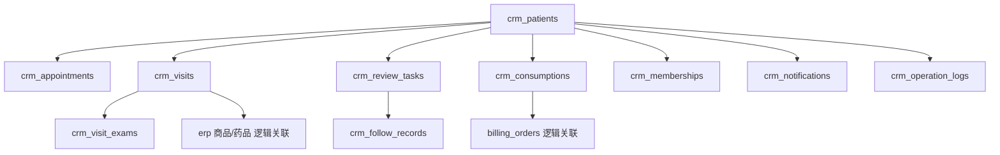
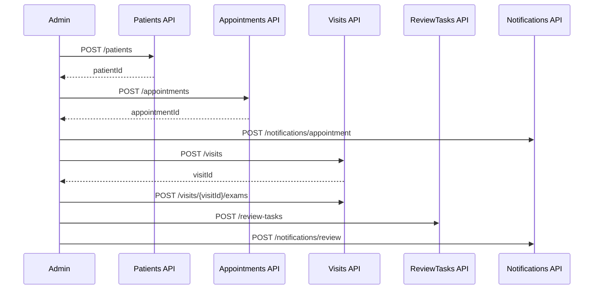

# 数据库表结构 SQL 草案与 API 详细清单

## 1. 文档说明

本文件将以下两部分合并到同一文档中：

1. `数据库表结构 SQL 草案`
2. `API 详细清单与接口协议`

本文件用于承接以下文档：

1. `新CRM正式PRD.md`
2. `新CRM正式PRD-Admin骨架适配版.md`
3. `Admin页面清单与页面级原型说明.md`
4. `客户档案CRM字段字典与状态流转表.md`

本文件目标是让后端、前端、产品可以围绕同一份文档直接启动研发拆分。

## 2. 技术约定

## 2.1 数据库约定

本草案默认采用 `MySQL 8.0` 语法，字符集使用 `utf8mb4`。

说明：

1. 主键统一使用 `VARCHAR(36)` 作为占位方案，便于兼容 UUID / 雪花 ID / ULID。
2. 状态字段统一使用 `VARCHAR(32)`，不直接使用数据库 `ENUM`，方便后续扩展。
3. 跨模块对象如门店、员工、收费单、ERP 商品默认通过逻辑 ID 关联，不强制写死外键。
4. 主业务表统一采用软删除字段：`is_deleted`、`deleted_at`。

## 2.2 API 约定

### Base URL

后台 Admin 接口统一约定：

`/api/admin/crm`

### 通用响应结构

```json
{
  "code": 0,
  "message": "success",
  "data": {},
  "traceId": "req_xxx"
}
```

### 通用错误码建议

| code | 含义 |
|---|---|
| 0 | 成功 |
| 4001 | 参数错误 |
| 4003 | 权限不足 |
| 4004 | 数据不存在 |
| 4009 | 数据冲突 |
| 4010 | 状态不允许当前操作 |
| 5000 | 系统异常 |

### 分页约定

请求参数：

```json
{
  "page": 1,
  "pageSize": 20
}
```

分页响应：

```json
{
  "list": [],
  "page": 1,
  "pageSize": 20,
  "total": 100
}
```

## 3. 数据模型总览



## 4. 表清单

| 表名 | 说明 | 所属模块 |
|---|---|---|
| `crm_patients` | 患者主档案 | 客户列表/客户详情 |
| `crm_appointments` | 预约记录 | 预约管理 |
| `crm_visits` | 就诊记录 | 病史记录/新增就诊 |
| `crm_visit_exams` | 检查数据 | 病史记录 |
| `crm_review_tasks` | 回访/复查任务 | 回访管理 |
| `crm_follow_records` | 回访记录流水 | 回访管理 |
| `crm_consumptions` | 消费记录 | 消费管理 |
| `crm_memberships` | 会员记录 | 会员管理 |
| `crm_notifications` | 通知记录 | 预约/回访/客户详情 |
| `crm_operation_logs` | 操作日志 | 客户详情/后台日志 |

## 5. 通用审计字段约定

以下字段建议所有主业务表统一保留：

| 字段名 | 类型 | 说明 |
|---|---|---|
| `created_at` | DATETIME | 创建时间 |
| `created_by` | VARCHAR(36) | 创建人 ID |
| `updated_at` | DATETIME | 更新时间 |
| `updated_by` | VARCHAR(36) | 更新人 ID |
| `is_deleted` | TINYINT(1) | 是否删除，0否1是 |
| `deleted_at` | DATETIME | 删除时间 |

## 6. 数据库表结构 SQL 草案

## 6.1 患者主档案表 `crm_patients`

```sql
CREATE TABLE `crm_patients` (
  `id` VARCHAR(36) NOT NULL COMMENT '患者ID',
  `patient_no` VARCHAR(64) NOT NULL COMMENT '患者编号',
  `name` VARCHAR(64) NOT NULL COMMENT '患者姓名',
  `gender` VARCHAR(16) DEFAULT NULL COMMENT '性别：male/female/unknown',
  `birthday` DATE DEFAULT NULL COMMENT '出生日期',
  `mobile` VARCHAR(32) NOT NULL COMMENT '手机号',
  `wechat_open_id` VARCHAR(128) DEFAULT NULL COMMENT '小程序绑定标识',
  `wechat_bind_status` VARCHAR(32) DEFAULT 'unbound' COMMENT '绑定状态：unbound/bound',
  `source_type` VARCHAR(32) NOT NULL COMMENT '来源：mini_program/admin/manual_import/history_migration',
  `first_visit_date` DATE DEFAULT NULL COMMENT '首诊日期',
  `latest_visit_date` DATETIME DEFAULT NULL COMMENT '最近就诊时间',
  `latest_appointment_status` VARCHAR(32) DEFAULT NULL COMMENT '最近预约状态',
  `latest_diagnosis` VARCHAR(255) DEFAULT NULL COMMENT '最新诊断摘要',
  `latest_treatment_method` VARCHAR(255) DEFAULT NULL COMMENT '主要治疗手段摘要',
  `next_review_date` DATE DEFAULT NULL COMMENT '下次复查日期',
  `follow_status` VARCHAR(32) DEFAULT 'new' COMMENT '跟进状态',
  `patient_tags` JSON DEFAULT NULL COMMENT '患者标签JSON',
  `primary_store_id` VARCHAR(36) DEFAULT NULL COMMENT '所属门店ID',
  `primary_store_name` VARCHAR(128) DEFAULT NULL COMMENT '所属门店名称',
  `owner_staff_id` VARCHAR(36) DEFAULT NULL COMMENT '责任验光师ID',
  `owner_staff_name` VARCHAR(64) DEFAULT NULL COMMENT '责任验光师名称',
  `member_status` VARCHAR(32) DEFAULT 'non_member' COMMENT '会员状态',
  `remark` VARCHAR(500) DEFAULT NULL COMMENT '备注',
  `is_active` TINYINT(1) NOT NULL DEFAULT 1 COMMENT '是否启用',
  `created_at` DATETIME NOT NULL DEFAULT CURRENT_TIMESTAMP,
  `created_by` VARCHAR(36) DEFAULT NULL,
  `updated_at` DATETIME NOT NULL DEFAULT CURRENT_TIMESTAMP ON UPDATE CURRENT_TIMESTAMP,
  `updated_by` VARCHAR(36) DEFAULT NULL,
  `is_deleted` TINYINT(1) NOT NULL DEFAULT 0,
  `deleted_at` DATETIME DEFAULT NULL,
  PRIMARY KEY (`id`),
  UNIQUE KEY `uk_patient_no` (`patient_no`),
  KEY `idx_mobile` (`mobile`),
  KEY `idx_owner_staff_id` (`owner_staff_id`),
  KEY `idx_primary_store_id` (`primary_store_id`),
  KEY `idx_follow_status` (`follow_status`),
  KEY `idx_latest_visit_date` (`latest_visit_date`)
) ENGINE=InnoDB DEFAULT CHARSET=utf8mb4 COMMENT='患者主档案表';
```

## 6.2 预约记录表 `crm_appointments`

```sql
CREATE TABLE `crm_appointments` (
  `id` VARCHAR(36) NOT NULL COMMENT '预约ID',
  `appointment_no` VARCHAR(64) NOT NULL COMMENT '预约编号',
  `patient_id` VARCHAR(36) NOT NULL COMMENT '患者ID',
  `patient_name` VARCHAR(64) NOT NULL COMMENT '患者姓名冗余',
  `mobile` VARCHAR(32) NOT NULL COMMENT '手机号',
  `appointment_date` DATE NOT NULL COMMENT '预约日期',
  `appointment_period` VARCHAR(64) NOT NULL COMMENT '时段',
  `appointment_time_start` DATETIME DEFAULT NULL COMMENT '开始时间',
  `appointment_time_end` DATETIME DEFAULT NULL COMMENT '结束时间',
  `store_id` VARCHAR(36) NOT NULL COMMENT '门店ID',
  `store_name` VARCHAR(128) DEFAULT NULL COMMENT '门店名称',
  `room_id` VARCHAR(36) DEFAULT NULL COMMENT '诊室ID',
  `room_name` VARCHAR(128) DEFAULT NULL COMMENT '诊室名称',
  `staff_id` VARCHAR(36) DEFAULT NULL COMMENT '预约验光师ID',
  `staff_name` VARCHAR(64) DEFAULT NULL COMMENT '预约验光师名称',
  `source_type` VARCHAR(32) NOT NULL COMMENT '来源：mini_program/admin/manual',
  `patient_tags` JSON DEFAULT NULL COMMENT '用户标签JSON',
  `issue_desc` VARCHAR(500) DEFAULT NULL COMMENT '问题描述',
  `solution_expectation` VARCHAR(500) DEFAULT NULL COMMENT '解决方案预期',
  `remark` VARCHAR(500) DEFAULT NULL COMMENT '备注',
  `notification_status` VARCHAR(32) DEFAULT 'pending' COMMENT '通知状态',
  `appointment_status` VARCHAR(32) NOT NULL DEFAULT 'pending' COMMENT '预约状态',
  `arrival_status` VARCHAR(32) DEFAULT 'not_arrived' COMMENT '到诊状态',
  `created_role` VARCHAR(32) NOT NULL COMMENT '创建角色：patient/optometrist/admin',
  `created_at` DATETIME NOT NULL DEFAULT CURRENT_TIMESTAMP,
  `created_by` VARCHAR(36) DEFAULT NULL,
  `updated_at` DATETIME NOT NULL DEFAULT CURRENT_TIMESTAMP ON UPDATE CURRENT_TIMESTAMP,
  `updated_by` VARCHAR(36) DEFAULT NULL,
  `is_deleted` TINYINT(1) NOT NULL DEFAULT 0,
  `deleted_at` DATETIME DEFAULT NULL,
  PRIMARY KEY (`id`),
  UNIQUE KEY `uk_appointment_no` (`appointment_no`),
  KEY `idx_patient_id` (`patient_id`),
  KEY `idx_store_id` (`store_id`),
  KEY `idx_staff_id` (`staff_id`),
  KEY `idx_appointment_date` (`appointment_date`),
  KEY `idx_appointment_status` (`appointment_status`)
) ENGINE=InnoDB DEFAULT CHARSET=utf8mb4 COMMENT='预约记录表';
```

## 6.3 就诊记录表 `crm_visits`

```sql
CREATE TABLE `crm_visits` (
  `id` VARCHAR(36) NOT NULL COMMENT '就诊记录ID',
  `visit_no` VARCHAR(64) NOT NULL COMMENT '就诊记录编号',
  `patient_id` VARCHAR(36) NOT NULL COMMENT '患者ID',
  `appointment_id` VARCHAR(36) DEFAULT NULL COMMENT '关联预约ID',
  `visit_date` DATETIME NOT NULL COMMENT '就诊时间',
  `visit_type` VARCHAR(32) DEFAULT NULL COMMENT '首诊/复诊/复查',
  `store_id` VARCHAR(36) NOT NULL COMMENT '接诊门店ID',
  `store_name` VARCHAR(128) DEFAULT NULL COMMENT '接诊门店名称',
  `staff_id` VARCHAR(36) NOT NULL COMMENT '接诊验光师ID',
  `staff_name` VARCHAR(64) DEFAULT NULL COMMENT '接诊验光师名称',
  `chief_complaint` VARCHAR(500) DEFAULT NULL COMMENT '主诉',
  `diagnosis` VARCHAR(500) DEFAULT NULL COMMENT '诊断结论',
  `treatment_method` VARCHAR(255) DEFAULT NULL COMMENT '主要治疗手段',
  `treatment_plan` TEXT DEFAULT NULL COMMENT '治疗方案',
  `product_recommendation` VARCHAR(500) DEFAULT NULL COMMENT '推荐商品/套餐',
  `review_date` DATE DEFAULT NULL COMMENT '建议复查日期',
  `visit_status` VARCHAR(32) NOT NULL DEFAULT 'draft' COMMENT '就诊记录状态',
  `summary` VARCHAR(1000) DEFAULT NULL COMMENT '就诊摘要',
  `remark` VARCHAR(500) DEFAULT NULL COMMENT '备注',
  `linked_bill_id` VARCHAR(36) DEFAULT NULL COMMENT '关联收费单ID',
  `created_at` DATETIME NOT NULL DEFAULT CURRENT_TIMESTAMP,
  `created_by` VARCHAR(36) DEFAULT NULL,
  `updated_at` DATETIME NOT NULL DEFAULT CURRENT_TIMESTAMP ON UPDATE CURRENT_TIMESTAMP,
  `updated_by` VARCHAR(36) DEFAULT NULL,
  `is_deleted` TINYINT(1) NOT NULL DEFAULT 0,
  `deleted_at` DATETIME DEFAULT NULL,
  PRIMARY KEY (`id`),
  UNIQUE KEY `uk_visit_no` (`visit_no`),
  KEY `idx_patient_id` (`patient_id`),
  KEY `idx_appointment_id` (`appointment_id`),
  KEY `idx_visit_date` (`visit_date`),
  KEY `idx_staff_id` (`staff_id`),
  KEY `idx_visit_status` (`visit_status`)
) ENGINE=InnoDB DEFAULT CHARSET=utf8mb4 COMMENT='就诊记录表';
```

## 6.4 检查数据表 `crm_visit_exams`

```sql
CREATE TABLE `crm_visit_exams` (
  `id` VARCHAR(36) NOT NULL COMMENT '检查数据ID',
  `visit_id` VARCHAR(36) NOT NULL COMMENT '就诊记录ID',
  `exam_type` VARCHAR(32) NOT NULL COMMENT '检查类型',
  `od_va` VARCHAR(32) DEFAULT NULL COMMENT '右眼裸眼视力',
  `os_va` VARCHAR(32) DEFAULT NULL COMMENT '左眼裸眼视力',
  `od_bcva` VARCHAR(32) DEFAULT NULL COMMENT '右眼最佳矫正视力',
  `os_bcva` VARCHAR(32) DEFAULT NULL COMMENT '左眼最佳矫正视力',
  `od_sphere` DECIMAL(8,2) DEFAULT NULL COMMENT '右眼球镜',
  `od_cylinder` DECIMAL(8,2) DEFAULT NULL COMMENT '右眼柱镜',
  `od_axis` DECIMAL(8,2) DEFAULT NULL COMMENT '右眼轴位',
  `os_sphere` DECIMAL(8,2) DEFAULT NULL COMMENT '左眼球镜',
  `os_cylinder` DECIMAL(8,2) DEFAULT NULL COMMENT '左眼柱镜',
  `os_axis` DECIMAL(8,2) DEFAULT NULL COMMENT '左眼轴位',
  `se_value` DECIMAL(8,2) DEFAULT NULL COMMENT 'SE',
  `k1` DECIMAL(8,2) DEFAULT NULL COMMENT 'K1',
  `k2` DECIMAL(8,2) DEFAULT NULL COMMENT 'K2',
  `axial_length` DECIMAL(8,2) DEFAULT NULL COMMENT '眼轴',
  `axial_ratio` DECIMAL(8,2) DEFAULT NULL COMMENT '轴率比',
  `crt` DECIMAL(8,2) DEFAULT NULL COMMENT 'CRT',
  `rnfl` DECIMAL(8,2) DEFAULT NULL COMMENT 'RNFL',
  `iop` DECIMAL(8,2) DEFAULT NULL COMMENT '眼压',
  `corneal_thickness` DECIMAL(8,2) DEFAULT NULL COMMENT '角膜厚度',
  `endothelial_count` DECIMAL(10,2) DEFAULT NULL COMMENT '角膜内皮计数',
  `stereo_vision` VARCHAR(64) DEFAULT NULL COMMENT '立体视',
  `tbut` DECIMAL(8,2) DEFAULT NULL COMMENT '泪膜破裂时间',
  `schirmer` DECIMAL(8,2) DEFAULT NULL COMMENT '泪液分泌试验',
  `questionnaire_score` DECIMAL(8,2) DEFAULT NULL COMMENT '问卷得分',
  `questionnaire_result` VARCHAR(128) DEFAULT NULL COMMENT '问卷评价',
  `raw_metrics` JSON DEFAULT NULL COMMENT '扩展指标JSON',
  `remark` VARCHAR(500) DEFAULT NULL COMMENT '检查备注',
  `created_at` DATETIME NOT NULL DEFAULT CURRENT_TIMESTAMP,
  `created_by` VARCHAR(36) DEFAULT NULL,
  `updated_at` DATETIME NOT NULL DEFAULT CURRENT_TIMESTAMP ON UPDATE CURRENT_TIMESTAMP,
  `updated_by` VARCHAR(36) DEFAULT NULL,
  `is_deleted` TINYINT(1) NOT NULL DEFAULT 0,
  `deleted_at` DATETIME DEFAULT NULL,
  PRIMARY KEY (`id`),
  KEY `idx_visit_id` (`visit_id`),
  KEY `idx_exam_type` (`exam_type`)
) ENGINE=InnoDB DEFAULT CHARSET=utf8mb4 COMMENT='检查数据表';
```

## 6.5 回访/复查任务表 `crm_review_tasks`

```sql
CREATE TABLE `crm_review_tasks` (
  `id` VARCHAR(36) NOT NULL COMMENT '回访任务ID',
  `patient_id` VARCHAR(36) NOT NULL COMMENT '患者ID',
  `visit_id` VARCHAR(36) NOT NULL COMMENT '来源就诊记录ID',
  `task_type` VARCHAR(32) NOT NULL COMMENT '任务类型',
  `diagnosis` VARCHAR(255) DEFAULT NULL COMMENT '诊断摘要',
  `treatment_method` VARCHAR(255) DEFAULT NULL COMMENT '治疗手段摘要',
  `review_date` DATE NOT NULL COMMENT '应复查日期',
  `owner_staff_id` VARCHAR(36) DEFAULT NULL COMMENT '责任人ID',
  `owner_staff_name` VARCHAR(64) DEFAULT NULL COMMENT '责任人名称',
  `task_status` VARCHAR(32) NOT NULL DEFAULT 'pending' COMMENT '任务状态',
  `latest_contact_time` DATETIME DEFAULT NULL COMMENT '最近联系时间',
  `latest_contact_result` VARCHAR(32) DEFAULT NULL COMMENT '最近联系结果',
  `notify_count` INT NOT NULL DEFAULT 0 COMMENT '通知次数',
  `next_follow_date` DATE DEFAULT NULL COMMENT '下次跟进日期',
  `close_reason` VARCHAR(255) DEFAULT NULL COMMENT '关闭原因',
  `remark` VARCHAR(500) DEFAULT NULL COMMENT '备注',
  `created_at` DATETIME NOT NULL DEFAULT CURRENT_TIMESTAMP,
  `created_by` VARCHAR(36) DEFAULT NULL,
  `updated_at` DATETIME NOT NULL DEFAULT CURRENT_TIMESTAMP ON UPDATE CURRENT_TIMESTAMP,
  `updated_by` VARCHAR(36) DEFAULT NULL,
  `is_deleted` TINYINT(1) NOT NULL DEFAULT 0,
  `deleted_at` DATETIME DEFAULT NULL,
  PRIMARY KEY (`id`),
  KEY `idx_patient_id` (`patient_id`),
  KEY `idx_visit_id` (`visit_id`),
  KEY `idx_review_date` (`review_date`),
  KEY `idx_owner_staff_id` (`owner_staff_id`),
  KEY `idx_task_status` (`task_status`)
) ENGINE=InnoDB DEFAULT CHARSET=utf8mb4 COMMENT='回访复查任务表';
```

## 6.6 回访记录表 `crm_follow_records`

```sql
CREATE TABLE `crm_follow_records` (
  `id` VARCHAR(36) NOT NULL COMMENT '回访记录ID',
  `review_task_id` VARCHAR(36) NOT NULL COMMENT '回访任务ID',
  `patient_id` VARCHAR(36) NOT NULL COMMENT '患者ID',
  `contact_time` DATETIME NOT NULL COMMENT '联系时间',
  `contact_channel` VARCHAR(32) NOT NULL COMMENT '联系渠道',
  `contact_result` VARCHAR(32) NOT NULL COMMENT '联系结果',
  `content` VARCHAR(1000) DEFAULT NULL COMMENT '跟进内容',
  `next_action` VARCHAR(255) DEFAULT NULL COMMENT '下步动作',
  `next_follow_date` DATE DEFAULT NULL COMMENT '下次跟进日期',
  `operator_id` VARCHAR(36) DEFAULT NULL COMMENT '操作人ID',
  `operator_name` VARCHAR(64) DEFAULT NULL COMMENT '操作人名称',
  `created_at` DATETIME NOT NULL DEFAULT CURRENT_TIMESTAMP,
  `created_by` VARCHAR(36) DEFAULT NULL,
  `updated_at` DATETIME NOT NULL DEFAULT CURRENT_TIMESTAMP ON UPDATE CURRENT_TIMESTAMP,
  `updated_by` VARCHAR(36) DEFAULT NULL,
  `is_deleted` TINYINT(1) NOT NULL DEFAULT 0,
  `deleted_at` DATETIME DEFAULT NULL,
  PRIMARY KEY (`id`),
  KEY `idx_review_task_id` (`review_task_id`),
  KEY `idx_patient_id` (`patient_id`),
  KEY `idx_contact_time` (`contact_time`)
) ENGINE=InnoDB DEFAULT CHARSET=utf8mb4 COMMENT='回访记录表';
```

## 6.7 消费记录表 `crm_consumptions`

```sql
CREATE TABLE `crm_consumptions` (
  `id` VARCHAR(36) NOT NULL COMMENT '消费记录ID',
  `patient_id` VARCHAR(36) NOT NULL COMMENT '患者ID',
  `visit_id` VARCHAR(36) DEFAULT NULL COMMENT '就诊记录ID',
  `bill_id` VARCHAR(36) DEFAULT NULL COMMENT '收费单ID',
  `consumption_date` DATETIME NOT NULL COMMENT '消费日期',
  `plan_summary` VARCHAR(500) DEFAULT NULL COMMENT '方案情况',
  `discount_rate` DECIMAL(8,2) DEFAULT NULL COMMENT '成交折扣比例',
  `item_summary` VARCHAR(500) DEFAULT NULL COMMENT '消费项目',
  `original_amount` DECIMAL(12,2) DEFAULT NULL COMMENT '原价金额',
  `discount_amount` DECIMAL(12,2) DEFAULT NULL COMMENT '优惠金额',
  `paid_amount` DECIMAL(12,2) DEFAULT NULL COMMENT '实付金额',
  `payment_status` VARCHAR(32) NOT NULL DEFAULT 'unpaid' COMMENT '支付状态',
  `payment_method` VARCHAR(32) DEFAULT NULL COMMENT '支付方式',
  `cashier_staff_id` VARCHAR(36) DEFAULT NULL COMMENT '收费人ID',
  `cashier_staff_name` VARCHAR(64) DEFAULT NULL COMMENT '收费人名称',
  `remark` VARCHAR(500) DEFAULT NULL COMMENT '备注',
  `created_at` DATETIME NOT NULL DEFAULT CURRENT_TIMESTAMP,
  `created_by` VARCHAR(36) DEFAULT NULL,
  `updated_at` DATETIME NOT NULL DEFAULT CURRENT_TIMESTAMP ON UPDATE CURRENT_TIMESTAMP,
  `updated_by` VARCHAR(36) DEFAULT NULL,
  `is_deleted` TINYINT(1) NOT NULL DEFAULT 0,
  `deleted_at` DATETIME DEFAULT NULL,
  PRIMARY KEY (`id`),
  KEY `idx_patient_id` (`patient_id`),
  KEY `idx_visit_id` (`visit_id`),
  KEY `idx_bill_id` (`bill_id`),
  KEY `idx_payment_status` (`payment_status`),
  KEY `idx_consumption_date` (`consumption_date`)
) ENGINE=InnoDB DEFAULT CHARSET=utf8mb4 COMMENT='消费记录表';
```

## 6.8 会员记录表 `crm_memberships`

```sql
CREATE TABLE `crm_memberships` (
  `id` VARCHAR(36) NOT NULL COMMENT '会员记录ID',
  `patient_id` VARCHAR(36) NOT NULL COMMENT '患者ID',
  `member_no` VARCHAR(64) DEFAULT NULL COMMENT '会员编号',
  `member_level` VARCHAR(32) DEFAULT NULL COMMENT '会员等级',
  `package_name` VARCHAR(128) DEFAULT NULL COMMENT '套餐名称',
  `valid_from` DATE DEFAULT NULL COMMENT '生效日期',
  `valid_to` DATE DEFAULT NULL COMMENT '到期日期',
  `remaining_times` INT DEFAULT NULL COMMENT '剩余次数',
  `balance_amount` DECIMAL(12,2) DEFAULT NULL COMMENT '剩余余额',
  `membership_status` VARCHAR(32) NOT NULL DEFAULT 'inactive' COMMENT '会员状态',
  `activated_at` DATETIME DEFAULT NULL COMMENT '激活时间',
  `remark` VARCHAR(500) DEFAULT NULL COMMENT '备注',
  `created_at` DATETIME NOT NULL DEFAULT CURRENT_TIMESTAMP,
  `created_by` VARCHAR(36) DEFAULT NULL,
  `updated_at` DATETIME NOT NULL DEFAULT CURRENT_TIMESTAMP ON UPDATE CURRENT_TIMESTAMP,
  `updated_by` VARCHAR(36) DEFAULT NULL,
  `is_deleted` TINYINT(1) NOT NULL DEFAULT 0,
  `deleted_at` DATETIME DEFAULT NULL,
  PRIMARY KEY (`id`),
  KEY `idx_patient_id` (`patient_id`),
  KEY `idx_membership_status` (`membership_status`),
  KEY `idx_valid_to` (`valid_to`)
) ENGINE=InnoDB DEFAULT CHARSET=utf8mb4 COMMENT='会员记录表';
```

## 6.9 通知记录表 `crm_notifications`

```sql
CREATE TABLE `crm_notifications` (
  `id` VARCHAR(36) NOT NULL COMMENT '通知记录ID',
  `patient_id` VARCHAR(36) NOT NULL COMMENT '患者ID',
  `business_type` VARCHAR(32) NOT NULL COMMENT '业务类型',
  `related_id` VARCHAR(36) DEFAULT NULL COMMENT '关联业务ID',
  `channel` VARCHAR(32) NOT NULL COMMENT '发送渠道',
  `content` VARCHAR(1000) NOT NULL COMMENT '通知内容',
  `send_status` VARCHAR(32) NOT NULL DEFAULT 'pending' COMMENT '发送状态',
  `send_time` DATETIME DEFAULT NULL COMMENT '发送时间',
  `operator_name` VARCHAR(64) DEFAULT NULL COMMENT '操作人名称',
  `created_at` DATETIME NOT NULL DEFAULT CURRENT_TIMESTAMP,
  `created_by` VARCHAR(36) DEFAULT NULL,
  `updated_at` DATETIME NOT NULL DEFAULT CURRENT_TIMESTAMP ON UPDATE CURRENT_TIMESTAMP,
  `updated_by` VARCHAR(36) DEFAULT NULL,
  `is_deleted` TINYINT(1) NOT NULL DEFAULT 0,
  `deleted_at` DATETIME DEFAULT NULL,
  PRIMARY KEY (`id`),
  KEY `idx_patient_id` (`patient_id`),
  KEY `idx_business_type` (`business_type`),
  KEY `idx_related_id` (`related_id`),
  KEY `idx_send_status` (`send_status`)
) ENGINE=InnoDB DEFAULT CHARSET=utf8mb4 COMMENT='通知记录表';
```

## 6.10 操作日志表 `crm_operation_logs`

```sql
CREATE TABLE `crm_operation_logs` (
  `id` VARCHAR(36) NOT NULL COMMENT '日志ID',
  `patient_id` VARCHAR(36) DEFAULT NULL COMMENT '患者ID',
  `business_type` VARCHAR(32) NOT NULL COMMENT '业务类型',
  `business_id` VARCHAR(36) DEFAULT NULL COMMENT '业务对象ID',
  `action_type` VARCHAR(32) NOT NULL COMMENT '动作类型',
  `action_desc` VARCHAR(1000) NOT NULL COMMENT '动作描述',
  `operator_id` VARCHAR(36) DEFAULT NULL COMMENT '操作人ID',
  `operator_name` VARCHAR(64) DEFAULT NULL COMMENT '操作人名称',
  `operate_time` DATETIME NOT NULL DEFAULT CURRENT_TIMESTAMP COMMENT '操作时间',
  PRIMARY KEY (`id`),
  KEY `idx_patient_id` (`patient_id`),
  KEY `idx_business_type` (`business_type`),
  KEY `idx_business_id` (`business_id`),
  KEY `idx_operate_time` (`operate_time`)
) ENGINE=InnoDB DEFAULT CHARSET=utf8mb4 COMMENT='CRM操作日志表';
```

## 7. API 设计总览

## 7.1 接口分组

| 分组 | 说明 |
|---|---|
| 患者档案 API | 客户列表、客户详情、建档、编辑、状态与标签 |
| 预约管理 API | 新增预约、列表、详情、状态变更 |
| 就诊记录 API | 新增、编辑、详情、检查数据、状态流转 |
| 回访管理 API | 任务列表、详情、状态变更、跟进记录 |
| 消费管理 API | 消费列表、详情、与收银联动 |
| 会员管理 API | 会员列表、详情、状态变更 |
| 通知 API | 发送通知、通知记录查询 |
| 操作日志 API | 日志查询 |
| 字典与枚举 API | 页面初始化所需枚举、标签、门店、人员 |

## 7.2 路径命名建议

建议使用资源化路径：

1. `/api/admin/crm/patients`
2. `/api/admin/crm/appointments`
3. `/api/admin/crm/visits`
4. `/api/admin/crm/review-tasks`
5. `/api/admin/crm/consumptions`
6. `/api/admin/crm/memberships`
7. `/api/admin/crm/notifications`
8. `/api/admin/crm/logs`
9. `/api/admin/crm/dicts`

## 8. 患者档案 API

## 8.1 获取患者列表

### 接口

`GET /api/admin/crm/patients`

### 用途

用于客户列表页查询患者。

### Query 参数

| 参数 | 类型 | 必填 | 说明 |
|---|---|---|---|
| keyword | String | 否 | 姓名/手机号/患者编号 |
| storeId | String | 否 | 所属门店 |
| ownerStaffId | String | 否 | 责任验光师 |
| followStatus | String | 否 | 跟进状态 |
| memberStatus | String | 否 | 会员状态 |
| tag | String | 否 | 患者标签 |
| latestVisitStart | String | 否 | 最近就诊开始日期 |
| latestVisitEnd | String | 否 | 最近就诊结束日期 |
| page | Number | 否 | 页码 |
| pageSize | Number | 否 | 每页条数 |

### 返回示例

```json
{
  "code": 0,
  "message": "success",
  "data": {
    "list": [
      {
        "id": "p_001",
        "patientNo": "P20260001",
        "name": "张三",
        "mobile": "13800000000",
        "gender": "male",
        "latestVisitDate": "2026-05-01 10:00:00",
        "latestDiagnosis": "近视",
        "latestTreatmentMethod": "离焦镜片",
        "nextReviewDate": "2026-06-01",
        "followStatus": "under_followup",
        "memberStatus": "active",
        "primaryStoreName": "徐汇门店",
        "ownerStaffName": "王医生"
      }
    ],
    "page": 1,
    "pageSize": 20,
    "total": 1
  }
}
```

## 8.2 新增患者

### 接口

`POST /api/admin/crm/patients`

### Body

```json
{
  "name": "张三",
  "gender": "male",
  "birthday": "2012-05-01",
  "mobile": "13800000000",
  "sourceType": "admin",
  "primaryStoreId": "store_001",
  "ownerStaffId": "staff_001",
  "patientTags": ["first_visit", "high_follow"],
  "remark": "家长陪同"
}
```

### 返回示例

```json
{
  "code": 0,
  "message": "success",
  "data": {
    "id": "p_001",
    "patientNo": "P20260001"
  }
}
```

## 8.3 获取患者详情

### 接口

`GET /api/admin/crm/patients/{patientId}`

### 返回内容

1. 患者基础信息
2. 最近预约摘要
3. 最近就诊摘要
4. 最近回访摘要
5. 会员摘要

## 8.4 更新患者信息

### 接口

`PUT /api/admin/crm/patients/{patientId}`

### Body

```json
{
  "gender": "female",
  "birthday": "2011-08-01",
  "primaryStoreId": "store_002",
  "ownerStaffId": "staff_009",
  "patientTags": ["return_visit"],
  "remark": "更新备注"
}
```

## 8.5 更新患者启停状态

### 接口

`PATCH /api/admin/crm/patients/{patientId}/status`

### Body

```json
{
  "isActive": false,
  "reason": "重复档案合并"
}
```

## 8.6 获取患者时间轴

### 接口

`GET /api/admin/crm/patients/{patientId}/timeline`

### 返回内容

1. 预约记录摘要
2. 就诊记录摘要
3. 回访任务摘要
4. 消费记录摘要

## 9. 预约管理 API

## 9.1 获取预约列表

### 接口

`GET /api/admin/crm/appointments`

### Query 参数

| 参数 | 类型 | 必填 | 说明 |
|---|---|---|---|
| patientId | String | 否 | 患者ID |
| keyword | String | 否 | 姓名/手机号 |
| storeId | String | 否 | 门店 |
| staffId | String | 否 | 验光师 |
| sourceType | String | 否 | 来源 |
| appointmentStatus | String | 否 | 状态 |
| dateStart | String | 否 | 开始日期 |
| dateEnd | String | 否 | 结束日期 |
| page | Number | 否 | 页码 |
| pageSize | Number | 否 | 每页条数 |

## 9.2 新增预约

### 接口

`POST /api/admin/crm/appointments`

### Body

```json
{
  "patientId": "p_001",
  "appointmentDate": "2026-05-20",
  "appointmentPeriod": "上午",
  "storeId": "store_001",
  "roomId": "room_001",
  "staffId": "staff_001",
  "sourceType": "admin",
  "issueDesc": "复查视力",
  "solutionExpectation": "验光检查",
  "remark": "家长预约"
}
```

## 9.3 获取预约详情

### 接口

`GET /api/admin/crm/appointments/{appointmentId}`

## 9.4 改期预约

### 接口

`PATCH /api/admin/crm/appointments/{appointmentId}/reschedule`

### Body

```json
{
  "appointmentDate": "2026-05-22",
  "appointmentPeriod": "下午",
  "appointmentTimeStart": "2026-05-22 14:00:00",
  "appointmentTimeEnd": "2026-05-22 14:30:00",
  "storeId": "store_001",
  "roomId": "room_002",
  "staffId": "staff_003",
  "reason": "患者时间冲突"
}
```

## 9.5 更新预约状态

### 接口

`PATCH /api/admin/crm/appointments/{appointmentId}/status`

### Body

```json
{
  "appointmentStatus": "arrived",
  "reason": "患者到店"
}
```

支持状态：

1. `confirmed`
2. `arrived`
3. `in_service`
4. `completed`
5. `cancelled`
6. `no_show`

## 10. 就诊记录 API

## 10.1 获取就诊记录列表

### 接口

`GET /api/admin/crm/visits`

### Query 参数

| 参数 | 类型 | 必填 | 说明 |
|---|---|---|---|
| patientId | String | 否 | 患者ID |
| storeId | String | 否 | 门店 |
| staffId | String | 否 | 验光师 |
| visitStatus | String | 否 | 状态 |
| visitDateStart | String | 否 | 开始时间 |
| visitDateEnd | String | 否 | 结束时间 |
| page | Number | 否 | 页码 |
| pageSize | Number | 否 | 每页条数 |

## 10.2 新增就诊记录

### 接口

`POST /api/admin/crm/visits`

### Body

```json
{
  "patientId": "p_001",
  "appointmentId": "a_001",
  "visitDate": "2026-05-20 14:10:00",
  "visitType": "review",
  "storeId": "store_001",
  "staffId": "staff_001",
  "chiefComplaint": "复查视力变化",
  "diagnosis": "近视进展需持续干预",
  "treatmentMethod": "离焦镜片",
  "treatmentPlan": "继续佩戴并监测",
  "productRecommendation": "离焦镜片套餐",
  "reviewDate": "2026-06-20",
  "summary": "本次复查整体稳定",
  "remark": "建议一个月后复查"
}
```

## 10.3 获取就诊记录详情

### 接口

`GET /api/admin/crm/visits/{visitId}`

### 返回内容

1. 就诊记录主信息
2. 检查数据列表
3. 收费关联信息
4. 生成的回访任务摘要

## 10.4 更新就诊记录

### 接口

`PUT /api/admin/crm/visits/{visitId}`

## 10.5 更新就诊记录状态

### 接口

`PATCH /api/admin/crm/visits/{visitId}/status`

### Body

```json
{
  "visitStatus": "completed",
  "reason": "录入完成"
}
```

## 10.6 新增检查数据

### 接口

`POST /api/admin/crm/visits/{visitId}/exams`

### Body

```json
{
  "examType": "vision",
  "odVa": "4.8",
  "osVa": "4.9",
  "odSphere": -2.00,
  "odCylinder": -0.50,
  "odAxis": 180,
  "osSphere": -1.75,
  "osCylinder": -0.25,
  "osAxis": 175,
  "axialLength": 24.22,
  "remark": "本次结果稳定"
}
```

## 10.7 获取检查数据列表

### 接口

`GET /api/admin/crm/visits/{visitId}/exams`

## 11. 回访管理 API

## 11.1 获取回访任务列表

### 接口

`GET /api/admin/crm/review-tasks`

### Query 参数

| 参数 | 类型 | 必填 | 说明 |
|---|---|---|---|
| patientId | String | 否 | 患者ID |
| ownerStaffId | String | 否 | 责任人 |
| taskStatus | String | 否 | 任务状态 |
| reviewDateStart | String | 否 | 复查起始日期 |
| reviewDateEnd | String | 否 | 复查结束日期 |
| page | Number | 否 | 页码 |
| pageSize | Number | 否 | 每页条数 |

## 11.2 获取回访任务详情

### 接口

`GET /api/admin/crm/review-tasks/{taskId}`

## 11.3 创建回访任务

### 接口

`POST /api/admin/crm/review-tasks`

### Body

```json
{
  "patientId": "p_001",
  "visitId": "v_001",
  "taskType": "review_reminder",
  "reviewDate": "2026-06-20",
  "ownerStaffId": "staff_001",
  "remark": "复查提醒"
}
```

## 11.4 更新回访任务状态

### 接口

`PATCH /api/admin/crm/review-tasks/{taskId}/status`

### Body

```json
{
  "taskStatus": "waiting_visit",
  "reason": "患者已确认来院"
}
```

## 11.5 新增回访记录

### 接口

`POST /api/admin/crm/review-tasks/{taskId}/follow-records`

### Body

```json
{
  "contactTime": "2026-06-18 10:00:00",
  "contactChannel": "phone",
  "contactResult": "agreed_review",
  "content": "已联系家长，确认两天后来院",
  "nextAction": "等待到店",
  "nextFollowDate": "2026-06-20"
}
```

## 11.6 获取回访记录列表

### 接口

`GET /api/admin/crm/review-tasks/{taskId}/follow-records`

## 12. 消费管理 API

## 12.1 获取消费记录列表

### 接口

`GET /api/admin/crm/consumptions`

### Query 参数

| 参数 | 类型 | 必填 | 说明 |
|---|---|---|---|
| patientId | String | 否 | 患者ID |
| paymentStatus | String | 否 | 支付状态 |
| dateStart | String | 否 | 开始日期 |
| dateEnd | String | 否 | 结束日期 |
| storeId | String | 否 | 门店 |
| page | Number | 否 | 页码 |
| pageSize | Number | 否 | 每页条数 |

## 12.2 获取消费记录详情

### 接口

`GET /api/admin/crm/consumptions/{consumptionId}`

## 12.3 从收费单回写消费记录

### 接口

`POST /api/admin/crm/consumptions/sync-from-bill`

### Body

```json
{
  "billId": "bill_001",
  "patientId": "p_001",
  "visitId": "v_001"
}
```

说明：

1. 该接口通常由收银模块调用。
2. 用于把收费结果同步到 CRM 消费记录。

## 13. 会员管理 API

## 13.1 获取会员列表

### 接口

`GET /api/admin/crm/memberships`

## 13.2 新增会员记录

### 接口

`POST /api/admin/crm/memberships`

### Body

```json
{
  "patientId": "p_001",
  "memberLevel": "gold",
  "packageName": "离焦镜片年度套餐",
  "validFrom": "2026-05-01",
  "validTo": "2027-04-30",
  "remainingTimes": 12,
  "balanceAmount": 0
}
```

## 13.3 更新会员状态

### 接口

`PATCH /api/admin/crm/memberships/{membershipId}/status`

### Body

```json
{
  "membershipStatus": "active",
  "reason": "已激活"
}
```

## 14. 通知 API

## 14.1 获取通知记录列表

### 接口

`GET /api/admin/crm/notifications`

## 14.2 发送预约通知

### 接口

`POST /api/admin/crm/notifications/appointment`

### Body

```json
{
  "appointmentId": "a_001",
  "channel": "mini_program_subscribe"
}
```

## 14.3 发送复查通知

### 接口

`POST /api/admin/crm/notifications/review`

### Body

```json
{
  "reviewTaskId": "rt_001",
  "channel": "mini_program_subscribe"
}
```

## 14.4 重发通知

### 接口

`POST /api/admin/crm/notifications/{notificationId}/resend`

## 15. 操作日志 API

## 15.1 获取日志列表

### 接口

`GET /api/admin/crm/logs`

### Query 参数

| 参数 | 类型 | 必填 | 说明 |
|---|---|---|---|
| patientId | String | 否 | 患者ID |
| businessType | String | 否 | 业务类型 |
| businessId | String | 否 | 业务对象ID |
| page | Number | 否 | 页码 |
| pageSize | Number | 否 | 每页条数 |

## 16. 字典与初始化 API

## 16.1 获取标签字典

### 接口

`GET /api/admin/crm/dicts/patient-tags`

## 16.2 获取状态字典

### 接口

`GET /api/admin/crm/dicts/statuses`

### 返回内容

1. 患者跟进状态
2. 预约状态
3. 就诊记录状态
4. 回访任务状态
5. 支付状态
6. 会员状态

## 16.3 获取门店与人员选择项

### 接口

`GET /api/admin/crm/dicts/select-options`

### 返回内容

1. 门店列表
2. 验光师列表
3. 诊室列表
4. 可预约时段列表

## 17. 核心流程接口串联

## 17.1 后台建档到回访闭环



## 17.2 从预约到就诊再到收费

1. `POST /appointments`
2. `PATCH /appointments/{id}/status` -> `arrived`
3. `POST /visits`
4. `POST /visits/{visitId}/exams`
5. 收银模块生成账单
6. `POST /consumptions/sync-from-bill`

## 18. 权限建议

| 接口分组 | 患者 | 验光师 | 管理员 | 超级管理员 |
|---|---|---|---|---|
| 患者档案列表/详情 | 否 | 是 | 是 | 是 |
| 新增/编辑患者 | 否 | 是 | 是 | 是 |
| 预约管理 | 患者端另有小程序接口 | 是 | 是 | 是 |
| 新增/编辑就诊记录 | 否 | 是 | 是 | 是 |
| 回访任务与回访记录 | 否 | 是 | 是 | 是 |
| 消费记录 | 否 | 只读/部分可见 | 是 | 是 |
| 会员管理 | 否 | 只读/部分可见 | 是 | 是 |
| 通知重发 | 否 | 是 | 是 | 是 |
| 操作日志 | 否 | 只读部分 | 是 | 是 |

## 19. 开发优先级建议

## 19.1 P0

1. `crm_patients`
2. `crm_appointments`
3. `crm_visits`
4. `crm_visit_exams`
5. `crm_review_tasks`
6. `crm_follow_records`
7. 患者 / 预约 / 就诊 / 回访 API

## 19.2 P1

1. `crm_consumptions`
2. `crm_memberships`
3. `crm_notifications`
4. `crm_operation_logs`
5. 消费 / 会员 / 通知 / 日志 API

## 19.3 P2

1. 更细粒度字典配置
2. 更复杂的数据联动接口
3. 与 ERP、收银的自动化同步增强

## 20. 结论

这份文档已经把：

1. `数据库表结构 SQL 草案`
2. `API 详细清单与接口协议`

合并进同一份文档里，能够支持下一步研发继续细化。

如果继续往下推进，最适合的下一步是：

1. 生成 `数据库初始化 SQL 文件`
2. 生成 `OpenAPI / Swagger 风格接口文档`
3. 生成 `后端模块划分建议`
