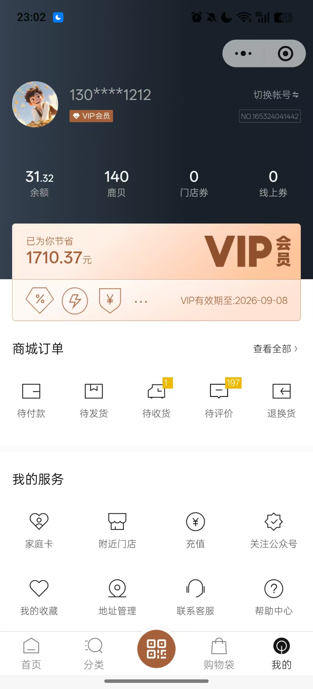

# 小程序页面详细清单（四 Tab 版）

## 一、调整结论

当前小程序底部 Tab 调整为：

1. `首页`
2. `预约`
3. `商城`
4. `我的`
---

## 二、底部 Tab 信息架构

### 1. 首页

定位：服务聚合首页，承接当前客户摘要、提醒信息和高频快捷入口。

页面设计：当前小程序首页功能不动，保持即可。

### 2. 预约

定位：门店预约、复诊预约、配镜预约等。

页面设计：当前系统有预约页面，首页的快速预约入口即可，所以预约页面这个 Tab 不需要额外开发，点击复用当前的预约功能即可。

### 3. 商城

定位：后续承接商品、套餐、会员权益购买能力。

当前阶段：

- 页面仅做占位
- 页面主文案：`开发中`，配一个购物车的 icon 图标。

### 4. 我的

定位：个人中心与家庭组管理中心，同时承接 CRM 侧与当前登录用户相关就诊人的数据查看能力。

页面参考：

整体设计：
  - 上中下布局
  - 上面是头像，昵称，手机号，id，余额、积分、优惠券，然后接着是商城订单相关：待付款、待发货、待收货、待评价、退换货。
  - 中间是门店服务：档案记录、配镜记录、我的预约、我的家庭组、我的就诊人
  - 下面是其他服务：充值、关注公众号、地址管理、联系客服、帮助中心、设置。

建议包含模块：

- 家庭组管理
- 当前就诊人切换
- 患者个人码
- 就诊档案
- 就诊记录
- 检查结果
- 配镜信息
- 消费记录
- 会员信息
- 通知中心
- 设置

---

## 三、详细页面清单

## 1. 首页 Tab

### 1.1 首页

页面目标：

- 作为小程序默认落地页
- 让家长 / 患者一进入就知道“当前是谁、最近发生了什么、下一步该做什么”

页面模块：

- 顶部用户信息区
  - 当前登录用户昵称
  - 当前家庭成员切换入口
- 当前就诊人卡片
  - 姓名
  - 性别 / 年龄
  - 最近就诊日期
  - 下次复查日期
  - 当前复查状态
- 复查提醒卡
  - 距离复查剩余天数
  - 立即预约按钮
  - 联系门店按钮
- 快捷服务区
  - 快速预约
  - 就诊档案
  - 就诊记录
  - 检查结果
  - 配镜信息
  - 消费记录
- 最近一次就诊摘要
  - 最近就诊日期
  - 本次诊断摘要
  - 医生建议摘要
  - 查看详情入口
- 健康资讯
  - 科普文章
  - 健康视频

对应 CRM：

- `档案列表`
- `客户档案详情`
- `回访管理`

---

### 1.2 当前就诊人切换弹层

页面目标：

- 在首页快速切换当前查看的家庭成员

页面内容：

- 家庭成员列表
- 成员关系
- 当前选中状态
- 新增成员入口

对应 CRM：

- `档案列表`

---

### 1.3 最近一次就诊详情页

页面目标：

- 从首页摘要进入完整就诊详情

页面分组建议：

- 基本信息
- 主诉与病史
- 眼部检查
- 辅助检查
- 诊断
- 医生建议 / 处理建议

说明：

- 页面展示逻辑沿用 CRM 中“就诊记录详情”的结构
- 但小程序端应为查看态，不提供录入编辑能力

对应 CRM：

- `客户档案详情 -> 就诊记录`

---

## 2. 预约 Tab

### 2.1 预约首页

页面目标：

- 统一承接新建预约、复查预约、查看预约记录

页面模块：

- 预约类型选择
  - 首诊
  - 复诊
  - 复查
  - 配镜复查
  - 视训
  - 其他
- 当前就诊人选择
- 推荐门店 / 最近门店
- 快捷入口
  - 新建预约
  - 预约记录

对应 CRM：

- `预约管理`

---

### 2.2 新建预约页

页面目标：

- 完成一条新的门店预约

页面字段：

- 就诊人
- 预约类型
- 门店
- 日期
- 时段
- 备注

页面动作：

- 提交预约
- 返回

对应 CRM：

- `预约管理`

---

### 2.3 复查预约页

页面目标：

- 从复查提醒直接进入预约流程

页面特征：

- 自动带入当前就诊人
- 自动带入建议复查日期
- 可直接选择门店和时段

对应 CRM：

- `回访管理`
- `预约管理`

---

### 2.4 预约记录页

页面目标：

- 查看当前就诊人的全部预约记录

页面字段：

- 预约日期
- 时段
- 门店
- 预约类型
- 状态
- 操作

支持操作：

- 查看详情
- 改期
- 取消

对应 CRM：

- `预约管理`
- `客户档案详情 -> 预约记录`

---

### 2.5 预约详情页

页面目标：

- 查看单条预约详情

页面内容：

- 就诊人信息
- 门店
- 预约时间
- 预约类型
- 备注
- 状态

支持操作：

- 改期
- 取消预约

对应 CRM：

- `预约管理`

---

## 3. 商城 Tab

### 3.1 商城首页

页面目标：

- 作为商城能力的占位页

当前版本要求：

- 页面只展示一张占位卡片
- 主标题：`商城`
- 页面文案：`开发中`

后续可扩展方向：

- 商品列表
- 套餐列表
- 会员购买
- 订单支付

对应 CRM：

- 暂无直接映射

---

## 4. 我的 Tab

### 4.1 我的首页

页面目标：

- 承接个人中心、家庭组管理与 CRM 查看能力入口

页面模块：

- 顶部用户信息
- 家庭组管理入口
- 患者个人码
- 我的服务列表
  - 就诊档案
  - 就诊记录
  - 检查结果
  - 配镜信息
  - 消费记录
  - 会员信息
  - 通知中心
  - 设置

对应 CRM：

- `档案列表`
- `客户档案详情`
- `消费记录`

---

### 4.2 家庭组管理页

页面目标：

- 管理家庭内多个就诊人

页面内容：

- 家庭成员列表
- 成员关系
- 当前默认查看成员
- 新增成员
- 编辑成员
- 删除成员

对应 CRM：

- `档案列表`

---

### 4.3 患者个人码页

页面目标：

- 用于门店扫码识别、关联档案、快速建联

页面内容：

- 患者姓名
- 患者编号
- 二维码 / 条码
- 使用说明

对应 CRM：

- `档案列表`

---

### 4.4 就诊档案页

页面目标：

- 展示当前就诊人的基础档案信息

页面内容：

- 基础资料
  - 姓名
  - 性别
  - 年龄
  - 手机号
- 标签 / 会员信息
- 最近就诊
- 下次复查

对应 CRM：

- `客户档案详情`

---

### 4.5 就诊记录列表页

页面目标：

- 查看当前就诊人的历次就诊记录

列表字段：

- 就诊日期
- 类型
- 诊断摘要
- 操作

对应 CRM：

- `客户档案详情 -> 就诊记录`

---

### 4.6 就诊记录详情页

页面目标：

- 查看单次就诊详情

页面分组：

1. 基本信息
2. 主诉与病史
3. 眼部检查
4. 辅助检查
5. 诊断
6. 医生建议 / 处理建议

说明：

- 这是小程序端查看态页面
- 内容来源要和 CRM 详情结构一致，以保证迁移和字段统一

对应 CRM：

- `客户档案详情 -> 就诊记录`

---

### 4.7 检查结果页

页面目标：

- 聚合展示关键检查指标与趋势

页面内容：

- 裸眼视力
- 矫正视力
- 球镜 / 柱镜 / 轴位
- 眼轴
- 角膜参数
- 眼压
- 趋势图

对应 CRM：

- `客户档案详情 -> 眼部检查`
- `客户档案详情 -> 辅助检查`

---

### 4.8 配镜信息页

页面目标：

- 查看当前用户的配镜信息及历史记录

页面内容：

- 当前镜片类型
- 左右眼参数
- 配镜日期
- 适配建议
- 下次复查时间
- 历史配镜记录

对应 CRM：

- `配镜信息`
- `客户档案详情 -> 就诊记录`

---

### 4.9 消费记录页

页面目标：

- 查看当前用户相关消费和订单信息

页面内容：

- 消费日期
- 项目
- 金额
- 支付状态
- 订单详情

对应 CRM：

- `消费记录`
- `单据收银`

---

### 4.10 会员信息页

页面目标：

- 展示当前会员等级与权益信息

页面内容：

- 当前等级
- 有效期
- 权益说明
- 购买记录 / 续费入口（后续）

对应 CRM：

- `会员相关能力`

---

### 4.11 通知中心页

页面目标：

- 承接预约、复查、回访、结果更新通知

页面内容：

- 预约成功通知
- 预约改期通知
- 复查提醒
- 回访通知
- 检查结果更新

对应 CRM：

- `预约管理`
- `回访管理`
- `客户档案详情`

---

### 4.12 设置页

页面目标：

- 提供账号与系统设置入口

页面内容：

- 账号信息
- 协议隐私
- 联系客服
- 退出登录

---

## 四、推荐一期优先级

建议一期优先实现页面如下：

1. 首页
2. 预约首页
3. 新建预约页
4. 预约记录页
5. 我的首页
6. 家庭组管理页
7. 就诊记录列表页
8. 就诊记录详情页
9. 配镜信息页
10. 患者个人码页
11. 商城占位页

---

## 五、与 CRM 的总体映射

### 小程序首页

对应 CRM：

- `档案列表`
- `客户档案详情`
- `回访管理`

### 小程序预约

对应 CRM：

- `预约管理`
- `客户档案详情 -> 预约记录`

### 小程序我的-就诊档案 / 就诊记录 / 检查结果

对应 CRM：

- `客户档案详情`
- `客户档案详情 -> 就诊记录`

### 小程序我的-配镜信息

对应 CRM：

- `配镜信息`

### 小程序我的-消费记录

对应 CRM：

- `消费记录`
- `单据收银`

### 小程序我的-通知中心

对应 CRM：

- `回访管理`
- `预约管理`

---

## 六、最终建议

本次结构调整后，建议小程序保持以下原则：

1. 底部 Tab 只保留四个：`首页 / 预约 / 商城 / 我的`
2. CRM 相关能力不再单独抽成一个 Tab，而是分散承接到：
   - `首页`：摘要与提醒
   - `预约`：预约与复查预约
   - `我的`：档案、记录、配镜、消费、通知
3. `商城` 当前阶段只做占位页，避免过早扩散设计范围

如果后续继续推进，下一步建议补一份：

- `小程序页面流转图`

这样就能直接进入小程序 PRD 或原型设计阶段。
